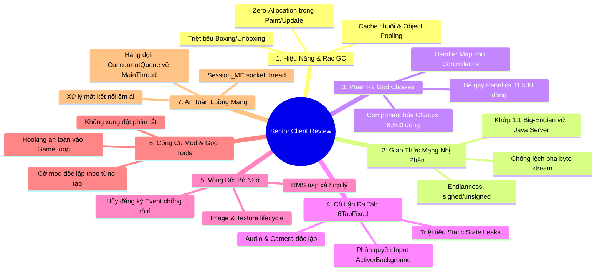

# Client Expert Suite - Cẩm Nang Kiểm Định & Tái Cấu Trúc Client Unity C# NRO

Bộ kỹ năng tối thượng giúp Agent phân tích, đánh giá và tối ưu hóa mã nguồn Client Unity C# của dự án Ngọc Rồng Online với trình độ chuyên sâu của một **Senior Game Client Architect** và tư duy sắc bén của **Claude**.

---

## 1. Triết Lý Đánh Giá Chuẩn Senior & Claude

Một Senior Client Engineer không bao giờ review hời hợt hay chỉ tập trung vào format thụt lề code. Khi soi mã nguồn Client NRO, Agent **BẮT BUỘC** phải thẩm định qua **Lăng Kính 7 Trụ Cột (The 7 Pillars)**:



---

## 2. Bản Đồ Tài Liệu Tham Khảo Chuyên Sâu (Progressive Disclosure)

Khi thực hiện review hoặc tối ưu client, Agent hãy đọc trực tiếp các tài liệu chuyên biệt dưới đây:

- [01. Unity GC & Performance Guide](./references/01_gc_and_performance_guide.md):
  *Hướng dẫn triệt tiêu rác bộ nhớ (GC Allocations), chống giật lag Drop FPS, loại bỏ chuỗi ghép trong `paint()` và thay thế `MyVector` bằng Generic.*
- [02. Protocol Sync & Network Forensics](./references/02_protocol_sync_and_network_forensics.md):
  *Phương pháp điều tra desync mạng, đối soát 1:1 từng byte nhị phân giữa Java Server và C# Client, bẫy đọc ghi kiểu dữ liệu.*
- [03. God Classes Refactoring Playbook](./references/03_god_classes_refactoring_playbook.md):
  *Cẩm nang tái cấu trúc và phân rã các file nghìn dòng (Panel.cs, Char.cs, GameScr.cs, Controller.cs) theo Component và SubPanel Stack.*
- [04. Multi-Tab & State Isolation](./references/04_multitab_and_state_isolation.md):
  *Quy chuẩn chạy 6 Tab mượt mà không leak biến tĩnh, điều khiển layout màn hình, âm thanh và input.*
- [05. Senior Client Review Report Template](./references/05_senior_client_review_report_template.md):
  *Khung mẫu báo cáo thẩm định chuẩn Senior Architect với bảng điểm Scorecard 100 điểm, phân tích rủi ro và diff code giải pháp.*

---

## 3. Quy Trình 5 Bước Review Client Chuẩn Senior

1. **Bước 1: Chạy Quét Tĩnh (Static Analysis)**:
   - Sử dụng script [scan_client_smells.py](./scripts/scan_client_smells.py) để có bức tranh tổng thể về mật độ rác GC và biến tĩnh trong thư mục mục tiêu:
     ```bash
     python .agents/skills/client-expert/scripts/scan_client_smells.py Client/Client/Assets/Scripts/Game1/
     ```
2. **Bước 2: Phân Tích Luồng Dữ Liệu & Vòng Lặp Game (Hotpath Profiling)**:
   - Soi kỹ các hàm `update()`, `paint()`, `onMessage()`.
   - Tìm mọi hành vi `new`, nối chuỗi, lạm dụng Reflection hoặc Linq.
3. **Bước 3: Đối Soát Giao Thức Nhị Phân (Nếu có liên quan đến Packet Mạng)**:
   - Mở song song file Server (`Service.java` hoặc `Controller.java`) và Client (`Controller.cs`, `Service.cs` hoặc `PacketDispatcher.cs`).
   - Lập bảng đối chiếu 1:1 từng trường dữ liệu byte-by-byte.
4. **Bước 4: Đánh Giá Tính Độc Lập Đa Tab (6TabFixed Isolation)**:
   - Đảm bảo không có biến tĩnh nào lưu trạng thái động của người chơi hoặc socket.
5. **Bước 5: Xuất Báo Cáo Theo Khung Mẫu Chuẩn**:
   - Sử dụng đúng cấu trúc của [05_senior_client_review_report_template.md](./references/05_senior_client_review_report_template.md).
