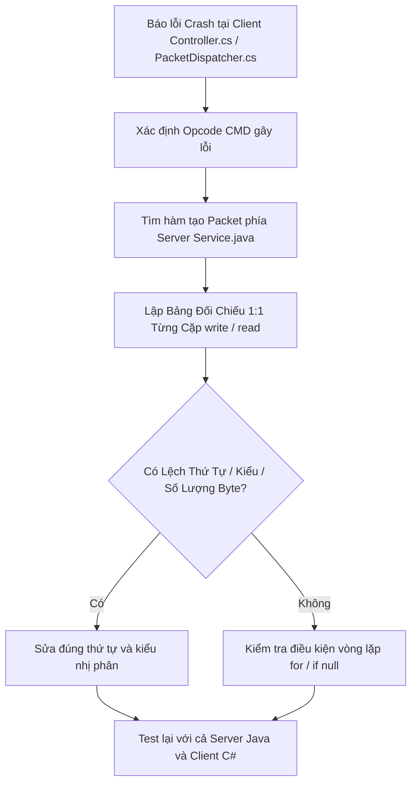

# Cẩm Nang Đối Soát Giao Thức Mạng Nhị Phân & Điều Tra Desync Client - Server

Tài liệu hướng dẫn chuyên gia điều tra và xử lý lệch pha giao thức mạng nhị phân giữa Server (Java Netty Big-Endian) và Client (Unity C# `myReader`/`myWriter`).

---

## 1. Bản Đồ Kiểu Dữ Liệu Tương Ứng 1:1 Giữa Java và C#

Trong Ngọc Rồng Online, luồng dữ liệu mạng hoàn toàn là Big-Endian thô (Raw Binary Stream). Chỉ cần lệch **1 byte** là toàn bộ dữ liệu phía sau của packet và các packet kế tiếp sẽ bị đọc sai, dẫn đến `EndOfStreamException`, crash game hoặc nhân vật bị đứng hình.

| Kiểu Java (Server) | Phương thức ghi Java | Kiểu C# (Client) | Phương thức đọc C# | Số byte | Bẫy thường gặp |
| :--- | :--- | :--- | :--- | :--- | :--- |
| `byte` / `boolean` | `writeByte(val)` | `sbyte` / `bool` | `readByte()` / `readBoolean()` | 1 | Giá trị signed (-128..127) vs unsigned (0..255). |
| `short` / `char` | `writeShort(val)` | `short` | `readShort()` | 2 | Tràn số khi Id item hoặc tọa độ vượt 32.767. |
| `int` | `writeInt(val)` | `int` | `readInt()` | 4 | Chỉ số HP/MP/Dame hoặc SMTN vượt 2.147.483.647. |
| `long` | `writeLong(val)` | `long` | `readLong()` | 8 | Sức mạnh, tiềm năng, vàng trên server là long. |
| `String` (UTF-8) | `writeUTF(str)` | `string` | `readUTF()` | 2 + N | 2 byte đầu là độ dài `short length`, sau đó là byte UTF-8. Nếu null phải ghi `""`. |

---

## 2. Quy Trình Điều Tra Lỗi Lệch Pha Nhị Phân (Desync Forensics)

Khi Client bị văng game (disconnect) hoặc crash với lỗi `IndexOutOfRangeException` / `EndOfStreamException` ngay sau khi nhận packet:

### Bảng Đối Chiếu Thực Chiến (Ví dụ CMD -42)
| Thứ tự | Java Server (`Service.java`) | Client C# (`Controller.cs`) | Khớp? |
| :---: | :--- | :--- | :---: |
| 1 | `msg.writer().writeByte(type);` | `sbyte type = msg.reader().readByte();` |  Khớp |
| 2 | `msg.writer().writeInt(playerId);` | `int playerId = msg.reader().readInt();` |  Khớp |
| 3 | `msg.writer().writeShort(iconId);` | `int iconId = msg.reader().readInt();` | ❌ **LỆCH: Server ghi 2 byte, Client đọc 4 byte!** |

*Hậu quả của bước 3: Client đọc lẹm mất 2 byte của trường thứ 4, làm hỏng toàn bộ packet!*

---

## 3. Các Bẫy Nguy Hiểm Cần Soi Kỹ Khi Review Code Client

1. **Chuỗi Null trong `writeUTF`**:
   - Trong Java: Nếu `str == null`, `writeUTF(str)` sẽ ném `NullPointerException`.
   - Nhưng nếu server dùng thư viện tùy biến ghi rỗng, client đọc `readUTF()` trả về `""`. Nếu client không check null hoặc rỗng mà truy cập `.Length` có thể sinh lỗi logic.
2. **Packet Mảng Động (Dynamic Array Length)**:
   - Server: Ghi `writeByte(list.size())` (tối đa 127/255 phần tử).
   - Nếu danh sách vượt quá 255 (ví dụ danh sách item ký gửi, danh sách thư), ghi `writeByte` sẽ bị tràn số vòng lặp (wrap-around), khiến client chỉ đọc một phần tử và bỏ sót dữ liệu. Bắt buộc dùng `writeShort` cho mảng lớn!
3. **Packet `-3` (Cộng SMTN)**:
   - Opcode `-3` ghi: `writeByte(type)`, `writeInt((int) param)`.
   - Chú ý: Vì dùng `writeInt`, nếu `param > 2.147.483.647L`, client sẽ nhận số âm!
4. **Luồng Thread-Safety trong `Session_ME`**:
   - `Session_ME` nhận packet trên Worker Thread của C# Socket.
   - Tuyệt đối không gọi trực tiếp các API của Unity Engine (`Transform`, `GameObject`, `Texture2D`) từ luồng Socket, vì Unity sẽ văng exception: *"get_transform can only be called from the main thread"*.
   - Mọi packet phải được đẩy vào hàng đợi và xử lý tại `Controller.onMessage` trên luồng chính (Main Game Loop).
