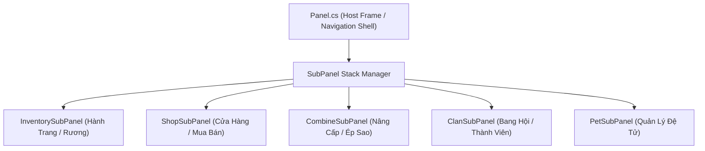

# Playbook Phân Rã & Tái Cấu Trúc Các God Classes Quái Vật Trong Client NRO

Cẩm nang quy chuẩn dành cho Senior Architect khi đối mặt và thuần hóa các "Monolithic God Classes" trong client Unity C# của Ngọc Rồng Online.

---

## 1. Bản Đồ Các "Quái Vật Nghìn Dòng" Trong NRO Client

Trong codebase client NRO, có 4 file khổng lồ nắm giữ hầu như toàn bộ logic của trò chơi:

1. **`Panel.cs` (~11.500 dòng, 466 KB)**:
   - Ôm đồm: Hành trang, Rương đồ, Cửa hàng (Shop), Nâng cấp đồ (Combine), Ký gửi (Consignment), Bang hội, Bản đồ kho báu, Đệ tử, Tin nhắn, Danh hiệu.
   - Code smell: Switch-case lồng nhau hàng chục tầng (`currentTabIndex`, `typeUI`), biến toàn cục tĩnh lộn xộn.
2. **`Char.cs` (~8.500 dòng, 215 KB)**:
   - Ôm đồm: Chỉ số nhân vật, Di chuyển, Trạng thái (đứng, chạy, bay, khỉ, lú lẫn), Vẽ hoạt ảnh (Animation Frame, Part, EffData), Xử lý va chạm, Nhặt đồ, Đánh nhau.
3. **`GameScr.cs` (~7.000 dòng, 240 KB)**:
   - Ôm đồm: Game loop chính, Camera, Vẽ bản đồ TileMap, Quản lý danh sách quái/người chơi/NPC, Phím tắt, MiniMap, Radar, Chat box, Thông báo bay.
4. **`Controller.cs` (~7.500 dòng, 358 KB)**:
   - Ôm đồm: Một switch-case khổng lồ xử lý hơn 120 opcode packet từ server, pha trộn việc parse binary stream với can thiệp UI trực tiếp.

---

## 2. Chiến Lược Phân Rã Panel.cs (Component & SubPanel Stack Pattern)

Thay vì sửa trực tiếp vào file `Panel.cs` gây nguy cơ hỏng giao diện, hãy áp dụng mô hình phân rã lũy tiến:



### Quy Tắc Thiết Kế Cho Từng SubPanel:
1. Mỗi SubPanel phải implement interface chuẩn:
   ```csharp
   public interface ISubPanel {
       void Init(Panel host);
       void Update();
       void Paint(mGraphics g);
       bool KeyPress(int keyCode);
       void OnPointerClick(int x, int y);
       void CleanUp();
   }
   ```
2. `Panel.cs` chỉ đóng vai trò là vỏ bọc (Shell Container) quản lý khung ngoài, nút thoát, thanh tab chuyển hướng và ủy quyền (delegate) sự kiện cho `currentSubPanel`.
3. Tách biệt hoàn toàn phần Render (`Paint`) và phần Logic Nghiệp Vụ (`Update/Action`).

---

## 3. Chiến Lược Phân Rã Char.cs (Entity-Component Pattern)

Biến đổi `Char.cs` từ một class nguyên khối thành Entity chứa các Components chuyên trách:

1. **`CharMovementComponent`**: Chịu trách nhiệm về tọa độ, gia tốc, trọng lực, trạng thái rơi, bay và va chạm với TileMap.
2. **`CharRenderComponent`**: Chịu trách nhiệm về nạp Part, tính toán Frame hoạt ảnh, biến Khỉ, Cải trang, vẽ bóng đổ và thanh HP.
3. **`CharCombatComponent`**: Quản lý chiêu thức đang chọn, thời gian hồi chiêu (cooldown), mục tiêu đang khóa (`focusChar`, `focusMob`).
4. **`CharStatusComponent`**: Quản lý các hiệu ứng trạng thái (Choáng, Đông cứng, Khiên năng lượng, Thôi miên, Dịch chuyển tức thời).

---

## 4. Chiến Lược Phân Rã Controller.cs (Packet Dispatcher Pattern)

Chuyển đổi switch-case 7.000 dòng trong `Controller.onMessage(Message msg)` sang mô hình **Handler Map**:

```csharp
public delegate void PacketHandler(Message msg);

public class PacketDispatcher {
    private static readonly Dictionary<sbyte, PacketHandler> handlers = new Dictionary<sbyte, PacketHandler>();

    public static void Register(sbyte cmd, PacketHandler handler) {
        handlers[cmd] = handler;
    }

    public static void Dispatch(Message msg) {
        if (handlers.TryGetValue(msg.command, out var handler)) {
            handler(msg);
        } else {
            // Fallback về legacy Controller nếu chưa chuyển đổi
            Controller.gI().onMessageLegacy(msg);
        }
    }
}
```

- **Lợi ích**: Mỗi tính năng mới (ví dụ Sự Kiện mới, Boss mới) có thể đặt hàm xử lý packet trong file riêng của module đó (`EventPacketHandler.cs`), không bao giờ phải chạm vào `Controller.cs` gốc!
