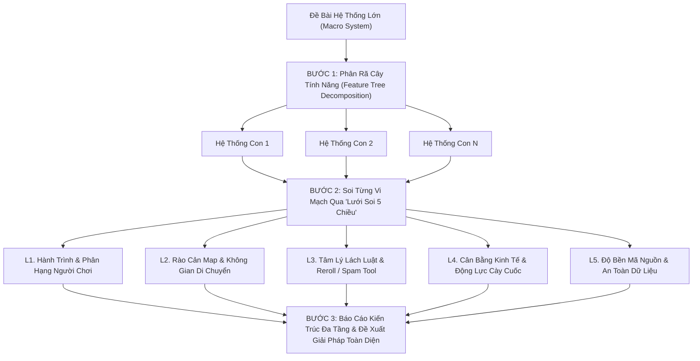

# Deep System Audit - Cẩm Nang Phân Tích & Đánh Giá Chuyên Sâu Hệ Thống Lớn

> **Tôn Chỉ Tối Thượng:**  
> *"Không bao giờ phân tích một hệ thống lớn dưới dạng nguyên khối bề nổi. Sức mạnh thực sự của một Senior Architect nằm ở khả năng phân rã hệ thống lớn thành những vi mạch chức năng, rồi soi rọi từng ngõ ngách logic dưới lăng kính của người chơi, kẻ gian lận, nhà thiết kế kinh tế và kỹ sư hệ thống."*

---

## 1. Nguyên Nhân Khiến Phân Tích Hệ Thống Lớn Thường Bị Nông Cạn

Khi đối mặt với một đề tài rộng (ví dụ: *"Review hệ thống nhiệm vụ"* hay *"Review hệ thống boss"*), AI và kỹ sư thường mắc phải 3 cái bẫy tư duy:
1. **Cái bẫy Monolithic (Nhìn tổng quan lướt qua)**: Cố gắng tóm tắt toàn bộ hệ thống trong một lượt, dẫn đến việc chỉ liệt kê tên class, các hàm chính và tìm vài lỗi cú pháp cơ bản (NullPointerException, switch-case).
2. **Thiếu Lăng Kính Hành Vi Người Chơi (Developer-only Blindspot)**: Chỉ soi code chạy được hay không, mà quên mất người chơi thực tế trải nghiệm thế nào (tân thủ có sang được map đó không, quái có quá mạnh không, phần thưởng có bèo bọt không).
3. **Bỏ Quên Vector Gian Lận & Lách Luật (Exploit Blindness)**: Không lường trước việc người chơi dùng tool/mod spam click, hủy nhiệm vụ nhận lại liên tục để reroll quái dễ, hay mở đa tab để dupe vật phẩm.

---

## 2. Quy Trình 3 Bước: Từ Đại Thể Đến Vi Mạch (Macro to Micro)

---

## 3. Chi Tiết Lưới Soi 5 Chiều (The 5-Dimension Micro-Lens)

Với **MỖI chức năng nhỏ** sau khi phân rã, Agent **BẮT BUỘC** phải tự chất vấn và trả lời đầy đủ 5 chiều:

### 🔍 Chiều 1: Hành Trình & Phân Hạng Người Chơi (Player Archetypes)
- **Tân thủ (Newbie - Dưới 1.5M SM)**:
  - Nhân vật mới tạo có bị ép làm việc bất khả thi không?
  - Quái được giao có đấm phát chết luôn người chơi không?
- **Sơ / Trung cấp (Mid-tier - 15M đến 150M SM)**:
  - Nội dung có quá nhàm chán hoặc bị ép quay về đánh quái làng không?
- **Cao thủ / Đỉnh cao (Endgame - Trên 1.5 Tỷ SM)**:
  - Thử thách có tương xứng không? Có phần thưởng độc quyền kích thích cạnh tranh không?

### 🗺️ Chiều 2: Rào Cản Map & Không Gian Di Chuyển (Map Gating & Reachability)
- **Kiểm tra tiến độ mở bản đồ**:
  - Quái mục tiêu ở map nào? Người chơi ở cấp độ/nhiệm vụ hiện tại **ĐÃ CÓ THỂ ĐI TỚI ĐÓ CHƯA**?
  - Đã có Tàu Vũ Trụ để bay sang hành tinh khác chưa (`taskMain.id >= 7`)?
  - Đã mở Map Fide/Cold chưa (`taskMain.id >= 16`)?
  - Đã mở Map Tương Lai/Xên Bọ Hung chưa (`taskMain.id >= 22`)?
  - Đã mở Map Thần Kaio/Hủy Diệt chưa (`taskMain.id >= 25`)?
- **Quy tắc bất biến**: *Tuyệt đối không bao giờ giao mục tiêu ở map mà nhân vật bị chặn cửa không thể vào!*

### ⚔️ Chiều 3: Tâm Lý Lách Luật & Vector Gian Lận (Abuse & Exploit Vectors)
- **Hành vi Reroll**: Người chơi có xu hướng bấm Hủy $\rightarrow$ Nhận lại để câu nhiệm vụ dễ/nhặt vàng không?
  - Nếu có: Đã có Cooldown chưa? Đã có cơ chế đổi tốn phí (Ngọc xanh/Vàng) chưa? Có giới hạn số lần miễn phí mỗi ngày không?
- **Hành vi Tool/Mod Packet Spam**: Người chơi gửi 100 packet/giây qua tool mod để spam nhận/trả/hủy thì Server có bị nghẽn Netty hoặc crash không?
- **Hành vi Đa Luồng / Race Condition**: Nhận quà đồng thời, mở 2 tab, hoặc vừa đánh vừa hủy.

### 💰 Chiều 4: Cân Bằng Kinh Tế & Động Lực Cày Cuốc (Progression & Economy)
- **TNSM (Tiềm năng sức mạnh)**: Có được cộng không? Mức cộng có bám sát công sức bỏ ra không?
- **Tiền tệ (Vàng / Thỏi vàng / Ngọc)**: Có kích thích cày cuốc không hay quá bèo bọt khiến tính năng bị "chết"?
- **Ô trống hành trang & Rác đồ**: Có bị nhét vật phẩm rác cố định làm đầy túi người chơi không?
- **Tỷ lệ may mắn (Loot Pool)**: Có cơ hội rơi đá nâng cấp, bùa, ngọc rồng để tạo cảm giác hồi hộp (gacha/lucky drop) không?

### 🛡️ Chiều 5: Độ Bền Kỹ Thuật & Lưu Trữ Dữ Liệu (Code & Data Integrity)
- **Thread-safety**: Đã bọc `synchronized` hoặc dùng Atomic khi cộng trừ biến đếm chưa?
- **Bounds Checking**: Các chỉ số index, array, list có bị `-1` hoặc `IndexOutOfBoundsException` không?
- **Data Persistence**: Khi lưu JSON xuống MySQL, có hỗ trợ tương thích ngược với tài khoản cũ không?
- **Daily Reset**: Khi qua 00h00 đêm, dữ liệu trong ngày có tự động làm mới qua `renew()` / `isAfterMidnight()` mà không xóa nhầm dữ liệu trọn đời không?

---

## 4. Tài Liệu Hướng Dẫn Chi Tiết (References)

Để áp dụng thuần thục quy trình trên, hãy tham khảo các tài liệu chuyên biệt đi kèm:
- [01. Recursive Decomposition Playbook](./references/01_recursive_decomposition_playbook.md):
  *Phương pháp bóc tách bất kỳ hệ thống game lớn nào thành cây tính năng vi mô.*
- [02. Gameplay & Player Journey Lens](./references/02_gameplay_and_player_journey_lens.md):
  *Bộ câu hỏi kiểm toán trải nghiệm người chơi từ Tân thủ đến Top 1 Server.*
- [03. Exploit, Abuse & Economy Audit](./references/03_exploit_abuse_and_economy_audit.md):
  *Checklist phát hiện lỗ hổng spam reroll, lạm dụng tool/mod, mất cân bằng kinh tế và tràn số.*
- [04. Deep Review Report Template](./references/04_deep_review_report_template.md):
  *Khung mẫu báo cáo chuẩn mực dành cho Senior Game Architect để trình bày với Team/User.*
