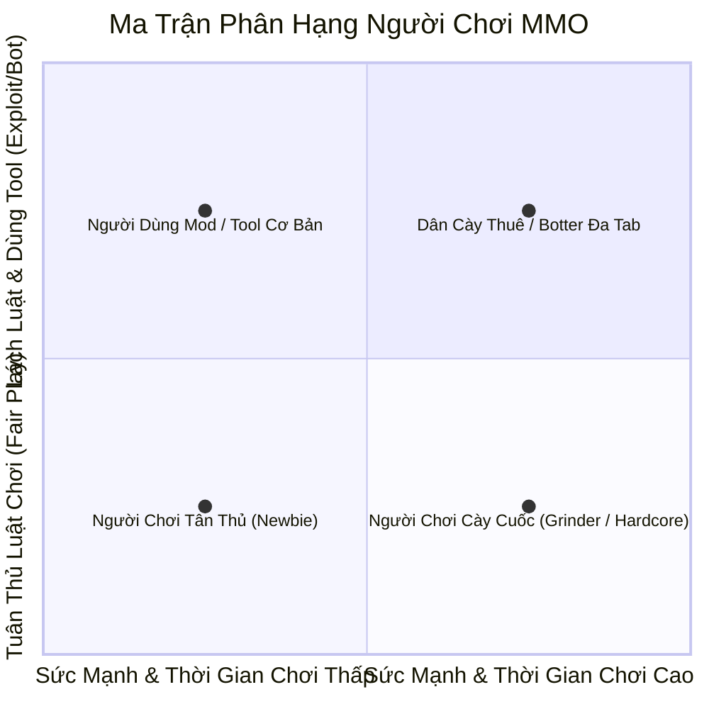

# Lăng Kính Hành Trình Người Chơi & Trải Nghiệm Gameplay (Player Journey Lens)

Khi lập trình viên hoặc AI review hệ thống, sai lầm phổ biến nhất là chỉ kiểm tra xem mã nguồn có chạy được hay không (Code-centric), mà quên mất **Cảm Xúc & Trải Nghiệm Của Người Chơi** (Player-centric).

Mỗi tính năng trong game phải được thẩm định qua 4 nhóm người chơi đại diện (4 Archetypes):

---

## 1. Bốn Nhóm Người Chơi Cốt Lõi (4 Player Archetypes)

---

## 2. Bộ Câu Hỏi Kiểm Toán Cho Từng Nhóm Người Chơi

### 👶 Nhóm 1: Người Chơi Tân Thủ (Newbie / F2P - Dưới 1.5M Sức Mạnh)
*Đặc điểm: Thiếu thông tin, chỉ số yếu, chưa có tàu vũ trụ, dễ nản lòng bỏ game nếu gặp rào cản vô lý.*
1. **Có bị kẹt không gian di chuyển không?**
   - Nhiệm vụ/tính năng có đòi hỏi đi sang hành tinh khác khi chưa có tàu vũ trụ không?
   - Map chỉ định có cho phép người chơi đi bộ tới được không?
2. **Có bị quái phản sát chết ngay không?**
   - Quái được giao có lượng HP hoặc Dame vượt quá ngưỡng chịu đựng của tân thủ không?
   - Trong cùng một dải quái sơ cấp, có bị lẫn quái boss/quái cao cấp (như Drum, Akkuman, Nappa) không?
3. **Phần thưởng khởi đầu có tạo động lực không?**
   - Có tặng Tiềm năng & Sức mạnh để tân thủ tăng cấp nhanh không?
   - Có tặng vàng để mua đậu thần hồi phục không?

### ⚔️ Nhóm 2: Người Chơi Sơ & Trung Cấp (Mid-tier - 15M đến 150M Sức Mạnh)
*Đặc điểm: Đã mở tàu vũ trụ, đang cày đệ tử, săn boss sơ cấp, bắt đầu tham gia bang hội.*
1. **Tính năng có phù hợp với tiến độ nhân vật không?**
   - Nếu nhân vật đạt 50M sức mạnh nhưng chưa hoàn thành nhiệm vụ chính, hệ thống có giải pháp gì để không ép họ đánh quái làng?
2. **Có động lực cày cuốc hàng ngày (Daily Retention) không?**
   - Nhiệm vụ hàng ngày có mang lại phần thưởng đáng giá (Ngọc xanh, Đá nâng cấp, Thỏi vàng) hay chỉ cho rác?
   - Số lượng quái cần tiêu diệt có vừa phải (5 - 15 phút) hay bắt đánh hàng chục nghìn con vô lý?

### 👑 Nhóm 3: Cao Thủ & Đỉnh Cao Server (End-game / P2W - Trên 1.5 Tỷ Sức Mạnh)
*Đặc điểm: Chỉ số cực cao, max trang bị, quan tâm đến Danh hiệu, Bảng xếp hạng, PVP, giải đấu.*
1. **Có thử thách xứng tầm không?**
   - Cấp độ cao nhất (Địa ngục, Giải đấu, Boss Thế giới) có đòi hỏi kỹ năng hoặc sức mạnh thực sự không?
2. **Có tính năng mở khóa danh hiệu & sự tự hào (Prestige) không?**
   - Hoàn thành nhiệm vụ cấp khó có được cộng điểm danh hiệu không? (Ví dụ: kiểm tra lỗi quên cộng danh hiệu Bò Mộng ở cấp Địa ngục).
3. **Phần thưởng có giá trị thanh khoản cao không?**
   - Thỏi vàng, Ngọc xanh, Đá quý cấp cao có thể dùng để ép sao, mua bán hoặc ký gửi được không?

### 🤖 Nhóm 4: Modder / Tooler & Kẻ Lách Luật (Botters & Exploiters)
*Đặc điểm: Cài bản mod, dùng auto click, macro phím, spam packet để trục lợi.*
1. **Người chơi sẽ lách luật như thế nào?**
   - Thấy nhiệm vụ khó $\rightarrow$ Bấm Hủy rồi Nhận lại liên tục để câu nhiệm vụ dễ/nhặt vàng (Reroll Spam).
   - Thua trận PVP $\rightarrow$ Tắt mạng để không bị trừ điểm/tiền cược.
   - Khi nhận thưởng $\rightarrow$ Gửi 2 packet song song để nhận quà gấp đôi.
2. **Hệ thống phòng thủ đã có gì?**
   - Cooldown thời gian chờ sau khi hủy/thất bại.
   - Phí đổi (Ngọc xanh/Vàng) để hạn chế spam.
   - Cơ chế khóa luồng `synchronized` và kiểm tra `isDone()`.

---

## 3. Checklist "Phòng Chống Cụt Hứng" (Dead-End Prevention Checklist)

- [ ] **Không có ngõ cụt logic**: Mọi menu đều phải có nút "Đóng", "Từ chối" hoặc đường thoát, không được kẹt popup vĩnh viễn.
- [ ] **Thông báo lý do rõ ràng**: Khi từ chối người chơi (chưa đủ sức mạnh, chưa mở map, hết lượt), phải chỉ rõ **LÝ DO** và **MỐC CẦN ĐẠT**, không được im lặng hoặc báo lỗi chung chung.
- [ ] **Bảo vệ túi đồ**: Không bao giờ ép người chơi nhận vật phẩm rác cố định làm chật rương (Junk item filling).
