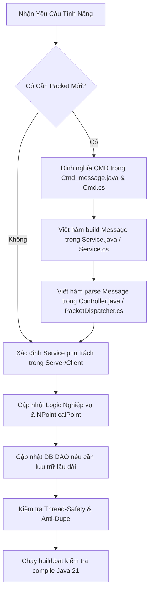

# NRO Expert Skill - Cẩm Nang Chuyên Gia Lập Trình Ngọc Rồng Online

Tài liệu hướng dẫn tư duy, quy trình và tri thức chuyên sâu dành cho Agent khi làm việc trên mã nguồn Ngọc Rồng Online (NRO).

---

## 1. Tư Duy Phân Tích Trước Khi Thực Hiện Tác Vụ

Trước khi viết bất kỳ dòng mã nào, hãy trả lời 4 câu hỏi định hướng:
1. **Phạm Vi Thay Đổi**:
   - Chỉ ở Server (Ví dụ: logic boss, tỷ lệ drop, sự kiện nạp thẻ, công thức chỉ số)?
   - Chỉ ở Client (Ví dụ: giao diện UI mới, phím tắt mod auto, tối ưu vẽ mGraphics, đa tab)?
   - Đồng bộ Cả Hai (Ví dụ: thêm item mới có chức năng, thêm skill mới, thêm NPC/giao dịch mới)?
2. **Giao Thức Nhất Quán**:
   - Nếu có truyền nhận packet, cấu trúc binary stream ở `Service.java`/`Service.cs` và `Controller.java`/`Controller.cs` đã khớp chính xác từng byte chưa?
3. **Tính Toàn Vẹn Dữ Liệu**:
   - Dữ liệu mới có cần lưu xuống MySQL (`nro_data`, `nro_acc`) không? Đã cập nhật `NDVSqlFetcher` và `PlayerDAO` chưa?
4. **An Toàn Luồng & Chống Dupe**:
   - Hành vi này có thể bị spam packet hoặc mở 2 tab thực hiện đồng thời để nhân bản vật phẩm không? Đã kiểm tra lock và `transactionService.check(player)` chưa?

---

## 2. Bản Đồ Tài Liệu Tham Khảo Chuyên Sâu (Progressive Disclosure)

Khi xử lý các bài toán cụ thể, Agent hãy đọc trực tiếp các tài liệu chuyên biệt dưới đây:

- [01. Protocol Cheatsheet](./references/01_protocol_cheatsheet.md):
  *Bảng tra cứu toàn diện Opcode mạng, cấu trúc nhị phân Big-endian, chuẩn hóa luồng đọc/ghi byte giữa Java và C#.*
- [02. Server Architecture Guide](./references/02_server_architecture.md):
  *Kiến trúc Netty, vòng lặp GameLoopManager, hệ thống Services, HikariCP Connection Pool, cấu trúc DAO JSON-serialization.*
- [03. Client Unity Architecture Guide](./references/03_client_unity_architecture.md):
  *Kiến trúc 6TabFixed, điều khiển giao diện UIWindowManager, module hóa PacketDispatcher, InventorySystem, và bộ công cụ God/HAIRMOD.*
- [04. NPoint & Gameplay Systems Reference](./references/04_npoint_and_gameplay_systems.md):
  *Công thức tính chỉ số NPoint, bảng mã Option Item, logic Hợp thể Porata, biến Khỉ, Đệ tử AI, hệ thống Bản đồ Zone/Map.*
- [05. Recipes & Runbooks](./references/05_recipes_and_runbooks.md):
  *Quy trình thực chiến bước-qua-bước: Thêm Item mới, Thêm Skill mới, Thêm NPC & Menu sự kiện, Thêm Boss AI, Tạo Packet RPC mới.*
- [06. Antipatterns & Anti-Dupe Checklist](./references/06_antipatterns_and_antidupe.md):
  *Cẩm nang ngăn chặn lỗi desync packet, chống triệt để các lỗ hổng dupe đồ qua Trade/Rương/Ký gửi, chống rò rỉ Connection DB.*
- [07. Server Design Patterns & Refactoring Guide](./references/07_design_patterns_and_refactoring.md):
  *Quy chuẩn phát hiện Code Smell, phá bỏ God Classes, chuẩn hóa Strategy/Command Pattern cho UseItem/Skill/NPC, State Machine cho Boss AI và kiến trúc Event Bus.*
- [08. Client Design Patterns & UI Refactoring Guide](./references/08_client_design_patterns_and_ui_refactoring.md):
  *Cẩm nang phá rã Panel.cs 11.500 dòng, Char.cs 8.500 dòng theo Component Pattern, SubPanel Stack, PacketDispatcher và Object Pooling chống giật lag GC trong Unity C#.*
- [09. Senior Backend Review Playbook](./references/09_senior_backend_review_playbook.md):
  *Cẩm nang 7 trụ cột đánh giá Backend chuẩn Senior Architect: Concurrency safety, Deadlock ordering, HikariCP resource leak, Integer overflow economy protection, Netty bytebuf lifecycle, Observability và thang đo Scorecard 100 điểm.*

---

## 3. Quy Trình Chuẩn Triển Khai Tính Năng (Standard Workflow)

### Bước 1: Tra cứu Opcode & Cấu trúc Dữ Liệu
Kiểm tra [01_protocol_cheatsheet.md](./references/01_protocol_cheatsheet.md) xem gói tin đã có sẵn hay cần định nghĩa mới. Đảm bảo tuân thủ quy chuẩn `writeByte`, `writeShort`, `writeInt`, `writeUTF`.

### Bước 2: Viết Logic Nghiệp Vụ Tại Server
- Tìm đúng Service chịu trách nhiệm (`ItemService`, `SkillService`, `ShopService`, `CombineService`...).
- Nếu thay đổi chỉ số người chơi: Gọi `player.nPoint.calPoint()` và `Service.gI().point(player)`.
- Nếu thay đổi vật phẩm: Cập nhật `InventoryService.gI().sendItemBag(player)`.

### Bước 3: Hoàn Thiện Phía Client (Unity C#)
- Xử lý gói tin phản hồi trong [PacketDispatcher.cs](file:///d:/SRC_NRO_219/SRC_NRO_219/SRC_NRO_189/SRC_NRO_OK/SRC_NRO_OK/DEMO_NETBEAN_tsSv2_new/Client/Client/Assets/Scripts/Game1/Network/PacketDispatcher.cs) hoặc [Controller.cs](file:///d:/SRC_NRO_219/SRC_NRO_219/SRC_NRO_189/SRC_NRO_OK/SRC_NRO_OK/DEMO_NETBEAN_tsSv2_new/Client/Client/Assets/Scripts/Game1/Controller.cs).
- Cập nhật hiển thị giao diện qua [UIWindowManager.cs](file:///d:/SRC_NRO_219/SRC_NRO_219/SRC_NRO_189/SRC_NRO_OK/SRC_NRO_OK/DEMO_NETBEAN_tsSv2_new/Client/Client/Assets/Scripts/Game1/UI/UIWindowManager.cs) hoặc `GameScr`.

### Bước 4: Kiểm Thử & Biên Dịch (Verification)
- Chạy lệnh biên dịch thử nghiệm Server bằng file [build.bat](file:///d:/SRC_NRO_219/SRC_NRO_219/SRC_NRO_189/SRC_NRO_OK/SRC_NRO_OK/DEMO_NETBEAN_tsSv2_new/build.bat) để đảm bảo cú pháp Java 21 hoàn toàn hợp lệ và tạo ra `dist/NROK.jar` thành công.
