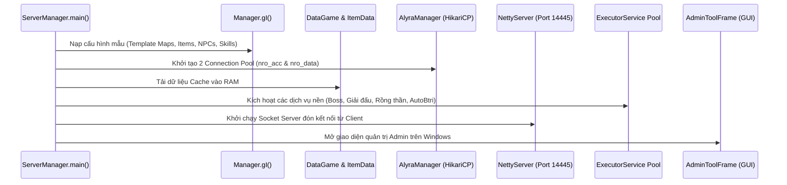

# NRO Server Architecture Guide (Java 21 LTS & Netty)

Tài liệu giải phẫu toàn diện kiến trúc Server của game Ngọc Rồng Online.

---

## 1. Vòng Đời Khởi Động & Điểm Nhập (Server Lifecycle)

Lớp khởi động chính là [ServerManager.java](file:///d:/SRC_NRO_219/SRC_NRO_219/SRC_NRO_189/SRC_NRO_OK/SRC_NRO_OK/DEMO_NETBEAN_tsSv2_new/src/server/ServerManager.java).



- **Thread Pool Quản Lý**:
  - `executorService`: `Executors.newFixedThreadPool(corePoolSize * 2)` xử lý tác vụ tải bản đồ, luồng boss và sự kiện.
  - `scheduledExecutorService`: 5 luồng định kỳ phụ trách auto-save dữ liệu nhân vật, giải đấu và bảo trì.
- **Shutdown Hook**: Đăng ký `cleanupResources()` để khi tắt server (Ctrl+C hoặc lệnh tắt), toàn bộ dữ liệu nhân vật đang online được lưu sạch xuống MySQL trước khi đóng socket.

---

## 2. Hệ Thống Cơ Sở Dữ Liệu & JSON Serialization

Hạ tầng lưu trữ tách biệt hoàn toàn 2 cơ sở dữ liệu:
1. **`nro_acc` (Quản lý tài khoản & bảo mật)**:
   - Bảng `account`: ID, username, password (đã hash qua BCrypt), `vnd`, `tongnap`, `ban`, `active`.
2. **`nro_data` (Dữ liệu trò chơi)**:
   - Bảng `player`: Chứa toàn bộ thông tin nhân vật.
   - Cơ chế lưu trữ JSON: Thay vì lưu hàng chục bảng quan hệ phức tạp, NRO lưu trữ trạng thái nhân vật thành các cột JSON text:
     - `items_bag`: Mảng JSON chứa vật phẩm trong túi đồ.
     - `items_body`: Mảng JSON trang bị đang mặc trên người.
     - `items_box`: Mảng JSON vật phẩm gửi trong rương.
     - `skills`: Danh sách kỹ năng và cấp độ.
     - `pet_info`: Chỉ số, trạng thái và trang bị của đệ tử.
     - `data_task`: Tiến trình nhiệm vụ chính tuyến và bang hội.

### Cấu Trúc Đối Tượng Item Khi Lưu Thành JSON
```json
[
  {
    "id": 194,
    "quantity": 1,
    "create_time": 1725420000000,
    "options": [
      {"id": 0, "param": 1200},
      {"id": 50, "param": 15},
      {"id": 107, "param": 7}
    ]
  }
]
```
- Phụ trách nạp: [NDVSqlFetcher.java](file:///d:/SRC_NRO_219/SRC_NRO_219/SRC_NRO_189/SRC_NRO_OK/SRC_NRO_OK/DEMO_NETBEAN_tsSv2_new/src/database/daos/NDVSqlFetcher.java).
- Phụ trách lưu: [PlayerDAO.java](file:///d:/SRC_NRO_219/SRC_NRO_219/SRC_NRO_189/SRC_NRO_OK/SRC_NRO_OK/DEMO_NETBEAN_tsSv2_new/src/database/daos/PlayerDAO.java).

---

## 3. Hệ Thống Dịch Vụ Nghiệp Vụ (Domain Services Map)

| Service Class | Trách Nhiệm Nghiệp Vụ Chính |
| :--- | :--- |
| **`ItemService`** | Khởi tạo item, chuyển đổi JSON, kiểm tra hạn sử dụng, phân giải option |
| **`InventoryService`** | Thêm/bớt item vào túi đồ, đổi trang bị vào người, cất đồ vào rương |
| **`SkillService`** | Tính sát thương chiêu thức, thời gian hồi chiêu, hồi mana, xử lý mục tiêu |
| **`CombineService`** | Nâng cấp trang bị (sao pha lê, bông tai Porata cấp 2, ép đồ sao) |
| **`ShopService`** | Mua/bán đồ tại NPC, xử lý tiền tệ vàng, ngọc xanh, ngọc hồng, điểm sự kiện |
| **`ConsignShopService`** | Chợ ký gửi siêu thị: ký gửi item, mua đồ, nhận vàng/ngọc |
| **`TaskService`** | Kiểm tra hoàn thành nhiệm vụ bò mộng, nhiệm vụ chính tuyến |
| **`PetService`** | Đệ tử: cộng tiềm năng, tăng chỉ số, nâng skill 2/3/4, đổi trạng thái |
| **`MapService` & `Zone`** | Quản lý không gian bản đồ, chuyển map, đồng bộ người chơi/quái trong khu |
| **`RewardService`** | Phần thưởng nhiệm vụ, điểm danh hàng ngày, mở rương may mắn |

---

## 4. Quản Lý Không Gian: Map & Zone

Mỗi bản đồ (`Map`) được chia thành nhiều khu vực (`Zone`, từ khu 0 đến khu N):
- Mỗi `Zone` có một vòng lặp cập nhật riêng (`Zone.update()`):
  - Hồi sinh quái vật (`Mob.update()`).
  - Hết hạn vật phẩm rơi dưới đất (`ItemMap.update()`).
  - Cập nhật hiệu ứng bùa/vệ tinh của người chơi trong khu.
- **Quy Tắc Quản Lý Danh Sách Người Chơi Trong Khu**:
  ```java
  // ĐÚNG: Tạo bản sao danh sách trước khi lặp qua người chơi
  List<Player> players = new ArrayList<>(zone.getPlayers());
  for (Player pl : players) {
      if (pl != null && pl.isPl()) {
          // Xử lý gửi thông báo hoặc gây sát thương diện rộng
      }
  }
  ```
  *Tuyệt đối không lặp trực tiếp trên `zone.players` vì nếu 1 người chơi chuyển map trong lúc vòng lặp đang chạy, hệ thống sẽ quăng `ConcurrentModificationException` làm ngưng toàn bộ vòng lặp của khu vực đó.*
