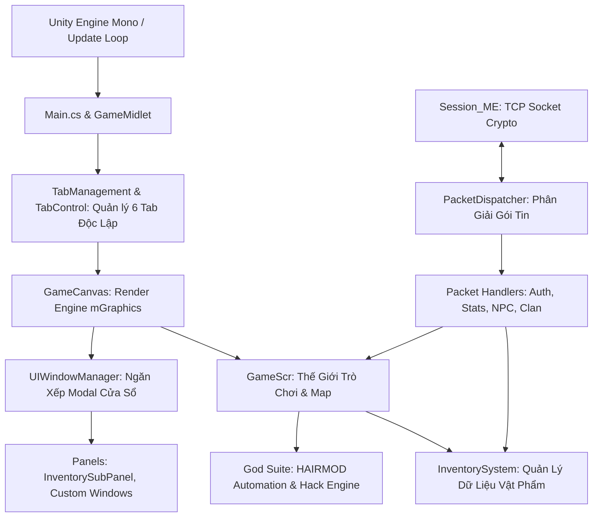

# NRO Client Unity Architecture Guide (6TabFixed & Modern C#)

Tài liệu giải phẫu kiến trúc Client Unity C# trong dự án Ngọc Rồng Online (thư mục `Client/Client` hoặc `6TabFixed`).

---

## 1. Bản Đồ Thành Phần Kiến Trúc Client



---

## 2. Hệ Thống Đa Tab Độc Lập (6TabFixed)

Khác với Client J2ME hay Client Unity nguyên bản chỉ chạy 1 tài khoản, bản `6TabFixed` cho phép chạy đồng thời lên tới 6 tài khoản trong cùng 1 cửa sổ game.

- **`TabManagement.cs` & `TabControl.cs`**:
  - Lưu trữ trạng thái phiên mạng, con trỏ nhân vật, và bộ nhớ hiển thị riêng cho từng Tab.
  - Phím chuyển tab: Tự động bắt sự kiện bấm tab hoặc các phím tắt được gán.
- **Quy Tắc Đa Tab**:
  - Không bao giờ sử dụng biến `static` lưu trữ thông tin nhân vật đang chơi mà không qua `Char.myCharz()`!
  - `Char.myCharz()` sẽ trả về đúng con trỏ `Char` của Tab đang active. Nếu dùng biến tĩnh tự do, thao tác trên Tab 1 sẽ ảnh hưởng nhầm sang nhân vật của Tab 2.

---

## 3. Quản Lý Giao Diện Hiện Đại: `UIWindowManager`

Để khắc phục tình trạng mã nguồn `Panel.cs` quá lớn (gần 500KB) khó bảo trì, hệ thống sử dụng [UIWindowManager.cs](file:///d:/SRC_NRO_219/SRC_NRO_219/SRC_NRO_189/SRC_NRO_OK/SRC_NRO_OK/DEMO_NETBEAN_tsSv2_new/Client/Client/Assets/Scripts/Game1/UI/UIWindowManager.cs) theo chuẩn giao diện cửa sổ:

```csharp
public interface IUIWindow
{
    bool IsVisible { get; }
    bool IsModal { get; }
    void OnOpen();
    void OnClose();
    void Update();
    void Paint(mGraphics g);
    bool HandleKey(int keyCode);
}
```

### Cách Sử Dụng UIWindowManager
```csharp
// Mở một cửa sổ mới lên đỉnh ngăn xếp:
UIWindowManager.gI().Push(myWindow);

// Tự động đóng cửa sổ trên cùng khi bấm phím ESC hoặc nút Đóng:
UIWindowManager.gI().Pop();

// Kiểm tra xem đang có cửa sổ Modal nào che màn hình không:
if (UIWindowManager.gI().HasActiveModal) {
    // Không cho nhận phím di chuyển nhân vật bên dưới
}
```

---

## 4. Module Hóa Packet Mạng: `PacketDispatcher`

Thay vì tiếp tục bổ sung lệnh `switch-case` vào file `Controller.cs` dài 6700 dòng, Client đã hỗ trợ kiến trúc [PacketDispatcher.cs](file:///d:/SRC_NRO_219/SRC_NRO_219/SRC_NRO_189/SRC_NRO_OK/SRC_NRO_OK/DEMO_NETBEAN_tsSv2_new/Client/Client/Assets/Scripts/Game1/Network/PacketDispatcher.cs):

```csharp
public interface IPacketHandler
{
    bool Handle(Controller controller, Message msg);
}
```

### Đăng Ký Handler Cho Các Gói Tin Mới
```csharp
public class EventPacketHandler : IPacketHandler
{
    public bool Handle(Controller controller, Message msg)
    {
        sbyte cmd = msg.command;
        if (cmd == 105) // Ví dụ packet Sự Kiện
        {
            int eventId = msg.reader().readInt();
            string eventName = msg.reader().readUTF();
            // Cập nhật giao diện...
            return true; // Đã xử lý thành công
        }
        return false;
    }
}

// Đăng ký trong PacketDispatcher:
PacketDispatcher.gI().Register(105, new EventPacketHandler());
```

---

## 5. Tách Rời Dữ Liệu & Giao Diện: `InventorySystem`

Lớp [InventorySystem.cs](file:///d:/SRC_NRO_219/SRC_NRO_219/SRC_NRO_189/SRC_NRO_OK/SRC_NRO_OK/DEMO_NETBEAN_tsSv2_new/Client/Client/Assets/Scripts/Game1/Systems/Inventory/InventorySystem.cs) là single source of truth cho túi đồ, trang bị và tiền tệ:
- `ItemsBag`: Danh sách vật phẩm trong hành trang.
- `ItemsBody`: Danh sách trang bị đang mặc.
- `ItemsBox`: Danh sách đồ trong rương.
- `OnInventoryChanged`: Sự kiện tự động phát ra khi có thay đổi đồ, giúp các panel UI đăng ký lắng nghe và tự vẽ lại mà không cần polling liên tục.

---

## 6. Bộ Công Cụ Tự Động & Hỗ Trợ: `God / HAIRMOD`

Thư mục `Game1/God` chứa các tiện ích mở rộng can thiệp trò chơi:
- **`Utils.cs`**:
  - `UseItem(int id)`: Tìm kiếm và kích hoạt sử dụng vật phẩm theo template ID.
  - `Teleport(int x, int y)`: Dịch chuyển tức thời nhân vật đến tọa độ mong muốn và gửi packet `charMove` lên server.
  - `FocusObject(int charId)`: Khóa mục tiêu vào người chơi chỉ định trong map.
  - `findItemBag(int id)`: Kiểm tra xem trong túi có vật phẩm chỉ định không.
  - `useItemWithTime(int id, long time)`: Tự động dùng vật phẩm duy trì hiệu ứng (ví dụ: bùa, thức ăn, cải trang) theo chu kỳ thời gian.
