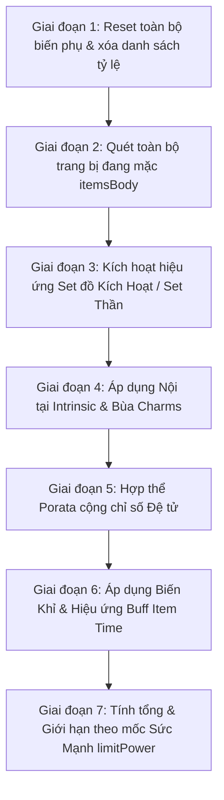

# NRO NPoint & Gameplay Systems Reference

Tài liệu chi tiết về động cơ tính toán chỉ số nhân vật (`NPoint`), bảng mã Option vật phẩm, hệ thống Đệ tử và cơ chế Kỹ năng trong Ngọc Rồng Online.

---

## 1. Động Cơ Tính Toán Chỉ Số: `NPoint.java`

Lớp [NPoint.java](file:///d:/SRC_NRO_219/SRC_NRO_219/SRC_NRO_189/SRC_NRO_OK/SRC_NRO_OK/DEMO_NETBEAN_tsSv2_new/src/models/player/NPoint.java) là trái tim toán học của toàn bộ server.

### Các Biến Trạng Thái Cốt Lõi
- **Chỉ số gốc (Base stats)**: `hpg` (Máu gốc), `mpg` (Ki gốc), `dameg` (Sức đánh gốc), `defg` (Giáp gốc), `critg` (Chí mạng gốc). Các chỉ số này tăng khi người chơi nâng tiềm năng.
- **Chỉ số cộng thêm (Flat Additions)**: `hpAdd`, `mpAdd`, `dameAdd`, `defAdd`, `critAdd`.
- **Danh sách tỷ lệ phần trăm (Percentage Modifiers)**:
  - `tlHp`: Danh sách % HP cộng thêm từ trang bị và bùa.
  - `tlMp`: Danh sách % MP cộng thêm.
  - `tlDame`: Danh sách % Sức đánh.
  - `tlDef`: Danh sách % Giáp.
  - `tlDameCrit`: Danh sách % Sát thương chí mạng.
  - `tlTNSM`: Danh sách % Tăng tiềm năng sức mạnh khi đánh quái.

---

## 2. Trình Tự Thực Thi Chuẩn Trong `calPoint()`

Khi nhân vật có bất kỳ thay đổi nào về trang bị, bùa hoặc hiệu ứng, hàm `calPoint()` sẽ thực hiện 7 giai đoạn liên tiếp:

### Công Thức Tính Tổng Quát Cho HP Max:
$$HP_{max} = (HP_{goc} + HP_{add}) \times \left(1 + \frac{\sum tlHp}{100}\right) + HP_{Porata}$$
*(Nếu biến Khỉ: Nhân thêm hệ số khỉ tùy cấp độ chiêu thức, ví dụ nhân 2.0 đến 3.0).*

---

## 3. Bảng Mã Option Item Phổ Biến (Option ID Reference)

Khi cấu hình trang bị trong Database `item_template` hoặc tạo vật phẩm bằng mã code, các Option ID sau được quy ước chuẩn:

| Option ID | Tên Option | Ý Nghĩa / Cách Tính Trong NPoint |
| :--- | :--- | :--- |
| `0` | **Tấn công +X** | Cộng trực tiếp X vào `dameAdd` |
| `6` | **HP +X** | Cộng trực tiếp X vào `hpAdd` |
| `7` | **KI +X** | Cộng trực tiếp X vào `mpAdd` |
| `14`| **Chí mạng +X%** | Cộng trực tiếp X vào `critAdd` (Tối đa 100%) |
| `47`| **Giáp +X** | Cộng trực tiếp X vào `defAdd` |
| `50`| **Sức đánh +X%** | Thêm X vào danh sách `tlDame` |
| `77`| **HP +X%** | Thêm X vào danh sách `tlHp` |
| `103`| **Biến Khỉ tăng dame +X%** | Tăng thêm X% sức đánh khi đang trong trạng thái hóa Khỉ |
| `108`| **Né đòn +X%** | Tỷ lệ né tránh các đòn đánh vật lý |
| `147`| **Sát thương chí mạng +X%**| Thêm X vào danh sách `tlDameCrit` (Mặc định chí mạng gây 200% dame) |
| `93` | **Hạn sử dụng X ngày** | Vật phẩm có thời hạn, hết hạn sẽ tự hủy |
| `30` | **Không thể giao dịch** | Khóa đồ vào nhân vật, không cho trade/ký gửi |

---

## 4. Hệ Thống Đệ Tử (Disciple / Pet System)

Được quản lý bởi lớp [Pet.java](file:///d:/SRC_NRO_219/SRC_NRO_219/SRC_NRO_189/SRC_NRO_OK/SRC_NRO_OK/DEMO_NETBEAN_tsSv2_new/src/models/player/Pet.java) và [PetService.java](file:///d:/SRC_NRO_219/SRC_NRO_219/SRC_NRO_189/SRC_NRO_OK/SRC_NRO_OK/DEMO_NETBEAN_tsSv2_new/src/services/PetService.java).

### Các Trạng Thái Của Đệ Tử (`status`)
- `0` - **Đi theo**: Đi theo sư phụ, tự hồi phục thể lực, không tấn công.
- `1` - **Bảo vệ**: Đứng cạnh sư phụ, tự động đánh mục tiêu tấn công sư phụ.
- `2` - **Tấn công**: Tự động tìm quái trong map để đánh và cày tiềm năng.
- `3` - **Về nhà**: Biến mất khỏi map, nghỉ ngơi tại nhà.
- `4` - **Hợp thể**: Hòa làm một với sư phụ thông qua Bông tai Porata.

### Hợp Thể Porata
- **Porata Cấp 1**: Sư phụ được cộng 100% các chỉ số của đệ tử (`hpMax`, `mpMax`, `dame`) vào chỉ số hiện tại.
- **Porata Cấp 2**: Tăng thêm tỷ lệ phần trăm (thường là +15% đến +20% sức đánh và máu).

---

## 5. Hệ Thống Kỹ Năng & Hiệu Ứng Chiêu Thức

- **Kỹ năng gây sát thương**:
  - Đấm Dragon / Demon / Galick: Sát thương cơ bản cận chiến.
  - Kamejoko / Masenko / Antomic: Sát thương tầm xa theo đường thẳng, tiêu tốn % MP lớn.
  - Quả Cầu Kênh Khi (Genki Dama): Tích tụ năng lượng trong vài giây rồi ném cầu gây sát thương khủng diện rộng.
- **Kỹ năng hiệu ứng & hỗ trợ**:
  - **Thái Dương Hạ San (Solar Flare)**: Gây mù và bất động tất cả mục tiêu trong phạm vi. Quản lý qua `EffectSkill.isStun` và `EffectSkill.timeStun`.
  - **Khiên Năng Lượng (Shield)**: Tạo khiên hấp thụ 100% sát thương, chuyển hóa sát thương nhận vào thành tiêu hao KI.
  - **Ma Phong Ba (Mafuba)**: Nhốt đối thủ vào bình chứa trong một khoảng thời gian nhất định.
  - **Tự Sát (Kamikaze)**: Tự hy sinh tính mạng, gây sát thương bằng toàn bộ HP hiện tại lên tất cả kẻ địch xung quanh.
