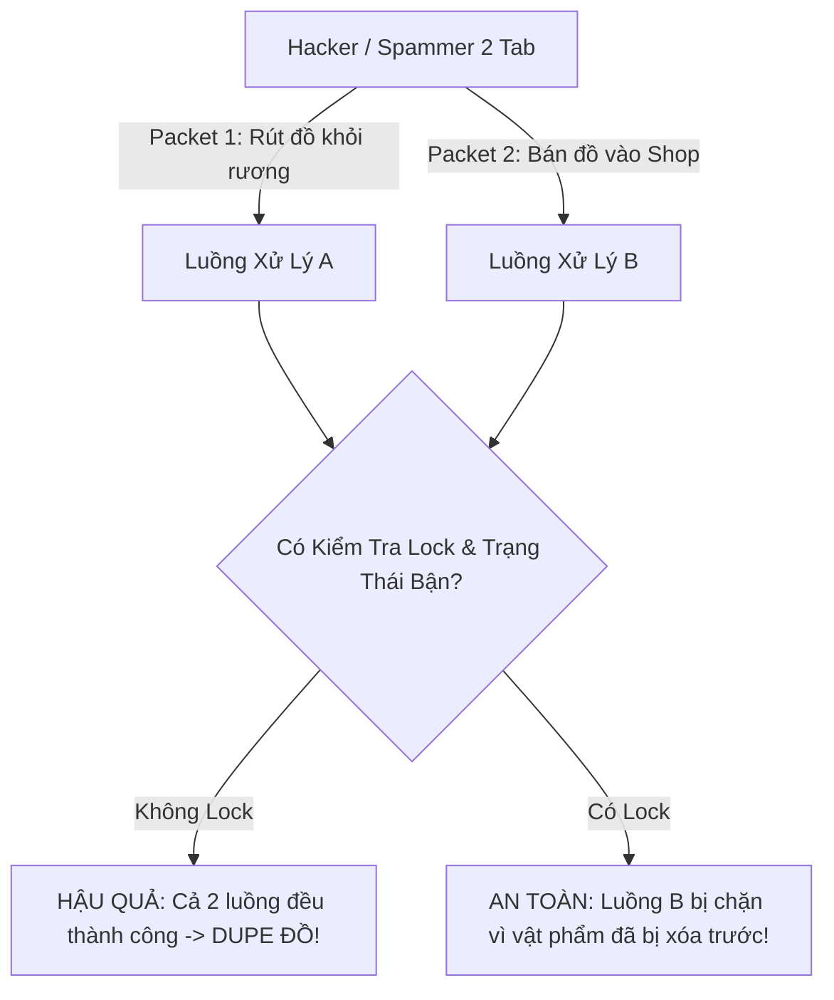

# NRO Anti-Patterns & Anti-Dupe Checklist

Tài liệu hướng dẫn nhận diện và triệt tiêu các lỗi kinh điển trong các server lậu Ngọc Rồng Online: Lỗ hổng nhân bản vật phẩm (Dupe đồ), Lỗi vỡ luồng (Crash Server), và Tràn bộ nhớ (Memory Leak).

---

## 1. Cẩm Nang Chống Dupe Đồ (Anti-Dupe Checklist)

Dupe đồ là vấn nạn nghiêm trọng nhất đối với game online. Các hacker thường lợi dụng độ trễ mạng (lag) hoặc dùng công cụ gửi đồng thời 2 packet cùng 1 mili-giây để nhân bản tài sản.



### Lỗ Hổng 1: Dupe Giao Dịch (Trade Dupe)
- **Kịch bản**: 2 người chơi ấn "Khóa giao dịch", sau đó 1 người chơi dùng tool ngắt kết nối mạng hoặc spam packet hủy giao dịch đúng lúc bấm "Xác nhận". Cả 2 đều nhận lại đồ của mình VÀ đồ của đối phương.
- **Biện Pháp Ngăn Chặn**:
  1. Kiểm tra trạng thái giao dịch: Cả 2 người chơi phải cùng ở trạng thái `Trade.TRADE_ACCEPT`.
  2. Khóa cứng hành trang: Trong lúc giao dịch, không cho phép sử dụng item, chuyển map, hoặc mở rương.
  3. Kiểm tra khoảng cách thời gian (Cooldown chống spam):
     ```java
     long now = System.currentTimeMillis();
     if (now - player.idMark.getLastTimeTrade() < 500) { // Tối thiểu 500ms giữa các lần thao tác
         return;
     }
     player.idMark.setLastTimeTrade(now);
     ```

### Lỗ Hổng 2: Dupe Ký Gửi Siêu Thị (Consign Shop Dupe)
- **Kịch bản**: Người chơi mở 2 tab game cùng 1 tài khoản, 1 tab bấm "Hủy ký gửi nhận lại đồ", tab kia bấm "Bán ký gửi" cùng lúc.
- **Biện Pháp Ngăn Chặn**:
  - Khi thực hiện hành động trên ký gửi, phải dùng khối đồng bộ hóa `synchronized`:
    ```java
    synchronized (player) {
        // 1. Kiểm tra vật phẩm có thực sự đang trong danh sách ký gửi không
        ConsignItem item = ConsignShopManager.gI().getItem(player, itemId);
        if (item == null) {
            Service.gI().sendThongBao(player, "Vật phẩm không tồn tại!");
            return;
        }
        // 2. Xóa khỏi danh sách ký gửi TRƯỚC TIÊN
        ConsignShopManager.gI().removeItem(item);
        
        // 3. Sau đó mới trả đồ vào túi người chơi
        InventoryService.gI().addItemBag(player, item.getItem());
        InventoryService.gI().sendItemBag(player);
    }
    ```

### Lỗ Hổng 3: Dupe Nâng Cấp Đồ / Ép Đồ (Combine Dupe)
- **Kịch bản**: Người chơi đưa đồ và đá nâng cấp vào NPC Bà Hạt Mít. Bấm "Nâng cấp" nhưng đồng thời gửi packet vứt đá ra đất.
- **Biện Pháp Ngăn Chặn**:
  - Luôn khấu trừ toàn bộ vật phẩm nguyên liệu và vàng TRƯỚC KHI tính toán tỷ lệ thành công hay thất bại. Nếu khấu trừ thất bại (do số lượng trong túi không đủ) $\rightarrow$ Hủy ngay lập tức!

---

## 2. Phòng Tránh Lỗi Tranh Chấp Luồng (Concurrency Pitfalls)

### Lỗi `ConcurrentModificationException` Trong Zone
- **Nguyên nhân**: Một luồng đang lặp qua danh sách `zone.getPlayers()` để gửi thông báo, trong khi một luồng khác thực hiện hàm `zone.exit(player)` làm thay đổi kích thước danh sách.
- **Cách khắc phục**:
  ```java
  // Tuyệt đối KHÔNG làm:
  for (Player pl : zone.getPlayers()) { ... } // NGUY HIỂM!
  
  // LUÔN LÀM: Tạo bản sao danh sách
  List<Player> players = new ArrayList<>(zone.getPlayers());
  for (Player pl : players) {
      if (pl != null) {
          // Xử lý an toàn
      }
  }
  ```

---

## 3. Phòng Tránh Rò Rỉ Bộ Nhớ & Kết Nối (Leak Prevention)

### 1. Rò Rỉ Kết Nối Cơ Sở Dữ Liệu (HikariCP Pool Exhaustion)
Nếu một phương thức lấy `Connection` từ `AlyraManager.getConnection()` nhưng gặp lỗi ngoại lệ (`Exception`) mà không vào được lệnh `con.close()`, kết nối đó sẽ bị treo mãi mãi. Sau 50 lần như vậy (đạt `MAX_CONN=50`), server sẽ tê liệt hoàn toàn mọi thao tác lưu/đọc CSDL.
- **Giải pháp**: Luôn dùng cú pháp `try-with-resources` tự động đóng:
  ```java
  try (Connection con = AlyraManager.getConnection();
       PreparedStatement ps = con.prepareStatement(query)) {
      // Thực thi lệnh an toàn tuyệt đối
  } catch (SQLException e) {
      Logger.error("Lỗi: " + e.getMessage());
  }
  ```

### 2. Rò Rỉ Bộ Nhớ Gói Tin (`Message.cleanup()`)
Mỗi đối tượng `Message` cấp phát một bộ đệm byte stream. Nếu không gọi `cleanup()`, Garbage Collector của Java sẽ mất nhiều thời gian dọn dẹp bộ đệm ngoài heap.
- **Quy tắc**: Luôn đặt `msg.cleanup()` trong khối `finally`.

---

## 4. Phòng Tránh Lệch Trạng Thái (State Desync)

### 1. Lỗi Âm Máu Hoặc Bất Tử (HP Desync)
- Khi nhân vật nhận sát thương, nếu `hp <= 0`, bắt buộc phải set `hp = 0` và kích hoạt hàm `player.setDie()` hoặc `Service.gI().charDie(player)`.
- Không bao giờ để `hp` mang giá trị âm, vì một số phép tính nhân chia sẽ làm đảo dấu thành cộng máu (hồi máu ngược thành bất tử).

### 2. Lỗi Trạng Thái Menu NPC
- Trước khi mở menu mới: Luôn xóa trạng thái menu cũ `player.idMark.clearMenu()`.
- Trong hàm `confirmMenu()`: Luôn kiểm tra `player.idMark.getIndexMenu()` khớp với menu đang thao tác để tránh việc người chơi gửi gói tin chọn menu của NPC A khi đang đứng ở NPC B.
