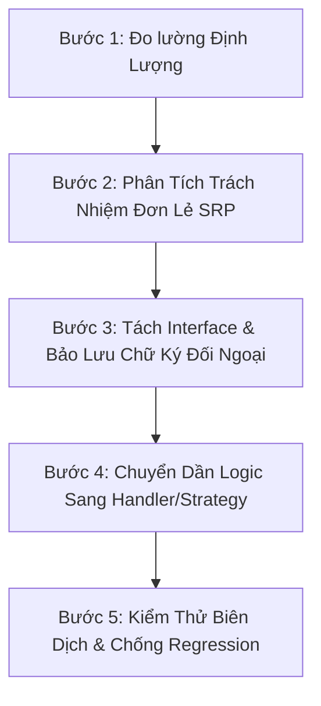

# 07. Hướng Dẫn Review & Tái Cấu Trúc Design Pattern Cho NRO Server (Java)

Tài liệu này cung cấp phương pháp luận, tiêu chí đánh giá và các mẫu thiết kế (Design Patterns) chuẩn mực dành riêng cho tầng Backend/Server Java NetBeans & Netty của Ngọc Rồng Online.
*(Đối với kiến trúc và tái cấu trúc Client Unity C#, vui lòng tham khảo chi tiết tại [08. Client Design Patterns & UI Refactoring Guide](./08_client_design_patterns_and_ui_refactoring.md)).*

---

## 1. Bộ Nhận Diện "Mùi Code" (Code Smell) Đặc Thù Trong NRO

| Code Smell | Dấu hiệu nhận biết trong NRO | Vị trí điển hình | Rủi ro & Hậu quả | Pattern giải quyết |
| :--- | :--- | :--- | :--- | :--- |
| **God Class / Blob** | Class phình to > 1.000 dòng, kiêm nhiệm nhiều nghiệp vụ không liên quan. | `Manager.java`, `UseItem.java`, `Service.java`, `Controller.cs` | Khó bảo trì, sửa chỗ này hỏng chỗ khác, xung đột merge git liên tục. | **Facade, Command, Strategy** |
| **Giant Switch-Case** | Switch-case hàng chục/hàng trăm nhánh theo `item.id`, `npc.id`, `skill.id`. | `UseItem.useItem()`, `NpcService.confirmMenu()` | Vi phạm nguyên tắc Open/Closed (OCP). Thêm tính năng mới phải sửa trực tiếp core switch. | **Strategy, Polymorphic Dispatch, Factory** |
| **Public Mutable Static Fields** | Khai báo `public static` cho biến có thể thay đổi giá trị từ mọi nơi. | `Manager.java`, `Service.java` | Race condition đa luồng, mất kiểm soát luồng dữ liệu, khó kiểm thử. | **Singleton Encapsulation, ThreadLocal, Inversion of Control** |
| **Spaghetti Boss AI** | Boss xử lý di chuyển, tìm mục tiêu, tung chiêu bằng if-else lồng nhau trong 1 vòng lặp `active()`. | `Boss.java`, các sub-class Boss | Boss bị đơ, giật lag, khó tạo cơ chế combat phức tạp (nhiều phase). | **Finite State Machine (FSM), State Pattern** |
| **Tight Coupling (Dính chặt)** | Các Service gọi chéo nhau trực tiếp (ví dụ: `Player` gọi `Service`, `Service` gọi `InventoryService`, `InventoryService` gọi `PlayerService`). | Toàn bộ package `services` | Vòng lặp phụ thuộc (Circular dependency), rò rỉ bộ nhớ khi hủy object. | **Observer / Event Bus, Mediator** |

---

## 2. Các Design Pattern Trọng Điểm & Mẫu Triển Khai Trong NRO

### Pattern 1: Strategy / Command Pattern (Xử lý Vật Phẩm & Kỹ Năng)
Thay vì switch-case 2.000 dòng trong `UseItem.java`, mỗi nhóm item được đóng gói thành một Command độc lập.

```java
// 1. Interface chuẩn
public interface ItemAction {
    boolean canHandle(Item item);
    void execute(Player player, Item item, int bagIndex);
}

// 2. Các Handler độc lập
public class ConsumablePeaAction implements ItemAction {
    @Override
    public boolean canHandle(Item item) {
        return item.template.type == 6; // Đậu thần
    }

    @Override
    public void execute(Player player, Item item, int bagIndex) {
        // Xử lý hồi máu/ki an toàn
    }
}

// 3. Dispatcher O(1) sử dụng Map hoặc List đăng ký động
public class ItemActionDispatcher {
    private static final Map<Integer, ItemAction> actionsByType = new HashMap<>();
    private static final Map<Integer, ItemAction> actionsById = new HashMap<>();

    public static void dispatch(Player player, Item item, int bagIndex) {
        ItemAction action = actionsById.get(item.template.id);
        if (action == null) {
            action = actionsByType.get((int) item.template.type);
        }
        if (action != null) {
            action.execute(player, item, bagIndex);
        } else {
            Service.gI().sendThongBao(player, "Vật phẩm chưa thể sử dụng.");
        }
    }
}
```

---

### Pattern 2: Finite State Machine - FSM (AI Boss & NPC Thông Minh)
Thay vì kiểm tra if-else trong `active()`, chia vòng đời của Boss thành các trạng thái rõ ràng:
`SPAWN` $\rightarrow$ `IDLE` $\rightarrow$ `CHASE` $\rightarrow$ `ATTACK` $\rightarrow$ `SPECIAL_SKILL` $\rightarrow$ `DIE`.

```java
public enum BossState {
    SPAWN, IDLE, CHASE, ATTACK, REST, DIE
}

public interface BossStateController {
    void enter(Boss boss);
    void update(Boss boss);
    void exit(Boss boss);
}
```

---

### Pattern 3: Event Bus / Observer Pattern (Giảm Phụ Thuộc Chéo)
Thay vì `Trade.java` hoặc `ShopService.java` phải tự gọi `TaskService.gI().checkDoneTask()`, `HistoryTransactionDAO.insert()`, ta phát ra Event:

```java
// Bắn sự kiện khi giao dịch thành công
EventBus.emit(new TradeCompletedEvent(player1, player2, items1, items2, gold1, gold2));

// TaskService tự đăng ký lắng nghe (Decoupled hoàn toàn)
EventBus.subscribe(TradeCompletedEvent.class, event -> {
    TaskService.gI().checkDoneTaskTrade(event.getPlayer1());
    TaskService.gI().checkDoneTaskTrade(event.getPlayer2());
});
```

---

## 3. Quy Trình Review 5 Bước Chuẩn Mực Cho File Mã Nguồn Lớn



1. **Bước 1: Đo lường Định Lượng (Quantitative Metrics)**:
   - Đo tổng số dòng (`LOC`), số method, số `public static fields`.
   - Nếu LOC > 800 và method > 25 $\rightarrow$ Đưa vào diện tái cấu trúc khẩn cấp.
2. **Bước 2: Phân tích SRP (Single Responsibility)**:
   - Liệt kê các trách nhiệm class đang gánh (ví dụ: `Manager.java` vừa đọc config, vừa đọc file binary map, vừa nạp DB, vừa quản lý resize ảnh).
3. **Bước 3: Tách Interface / Giữ tính tương thích ngược**:
   - Giữ nguyên các phương thức public static facade (như `Manager.gI()`, `UseItem.gI().doItem()`) làm cầu nối để các file cũ không bị lỗi compile.
4. **Bước 4: Chuyển dịch từng khối logic sang Handler con**:
   - Rút ruột từng switch-case hoặc từng block logic đưa vào class con chuyên trách.
5. **Bước 5: Kiểm tra xác minh tự động**:
   - Chạy `build.bat` sau mỗi lần tách nhỏ để kiểm tra exit code = 0.
