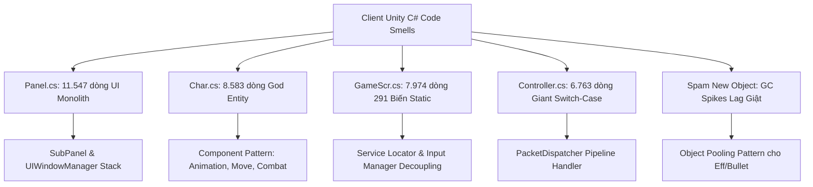

# 08. Cẩm Nang Design Patterns & Tái Cấu Trúc Toàn Diện Cho Client Unity C#

Tài liệu chuyên sâu giải quyết các "God Classes" khổng lồ trong Client Unity C# của Ngọc Rồng Online: [Panel.cs](file:///d:/SRC_NRO_219/SRC_NRO_219/SRC_NRO_189/SRC_NRO_OK/SRC_NRO_OK/DEMO_NETBEAN_tsSv2_new/Client/Client/Assets/Scripts/Game1/Panel.cs) (11.547 dòng), [Char.cs](file:///d:/SRC_NRO_219/SRC_NRO_219/SRC_NRO_189/SRC_NRO_OK/SRC_NRO_OK/DEMO_NETBEAN_tsSv2_new/Client/Client/Assets/Scripts/Game1/Char.cs) (8.583 dòng), [GameScr.cs](file:///d:/SRC_NRO_219/SRC_NRO_219/SRC_NRO_189/SRC_NRO_OK/SRC_NRO_OK/DEMO_NETBEAN_tsSv2_new/Client/Client/Assets/Scripts/Game1/GameScr.cs) (7.974 dòng), và [Controller.cs](file:///d:/SRC_NRO_219/SRC_NRO_219/SRC_NRO_189/SRC_NRO_OK/SRC_NRO_OK/DEMO_NETBEAN_tsSv2_new/Client/Client/Assets/Scripts/Game1/Controller.cs) (6.763 dòng).

---

## 1. Bản Đồ Code Smell & Giải Pháp Design Pattern Cho Client



---

## 2. Giải Pháp 1: Phân Rã `Panel.cs` Bằng SubPanel & UIWindowManager

### Hiện Trạng:
`Panel.cs` ôm đồm hơn 240 phương thức, hiển thị tất cả từ Hành Trang, Rương Đồ, Nâng Cấp, Đệ Tử, Bang Hội, Cửa Hàng, đến Sự Kiện trong cùng một file.

### Mô Hình SubPanel Mẫu (Component Pattern):
Mỗi tab trong Panel được tách thành một `ISubPanel` độc lập:

```csharp
public interface ISubPanel
{
    int TabIndex { get; }
    void OnShow(Panel parent);
    void Update(Panel parent);
    void Paint(mGraphics g, Panel parent);
    bool KeyPress(int keyCode, Panel parent);
    void PointerEvent(int x, int y, Panel parent);
}

// 1. Tách Rương Đồ: ChestSubPanel.cs
public class ChestSubPanel : ISubPanel
{
    public int TabIndex => 1; // Tab Rương

    public void Paint(mGraphics g, Panel parent)
    {
        // Chỉ vẽ lưới rương và thông tin vật phẩm trong rương
    }

    public bool KeyPress(int keyCode, Panel parent)
    {
        // Xử lý phím tắt cất đồ / rút đồ
        return true;
    }
}

// 2. Tách Hành Trang: InventorySubPanel.cs
public class InventorySubPanel : ISubPanel { ... }

// 3. Tách Đệ Tử: PetSubPanel.cs
public class PetSubPanel : ISubPanel { ... }
```

### Điều Hướng Trong `Panel.cs` Gốc:
```csharp
public class Panel
{
    private Dictionary<int, ISubPanel> subPanels = new Dictionary<int, ISubPanel>();

    public void initSubPanels()
    {
        RegisterSubPanel(new InventorySubPanel());
        RegisterSubPanel(new ChestSubPanel());
        RegisterSubPanel(new PetSubPanel());
    }

    public void paint(mGraphics g)
    {
        if (subPanels.TryGetValue(currentTabIndex, out var panel))
        {
            panel.Paint(g, this);
        }
    }
}
```

---

## 3. Giải Pháp 2: Phân Rã `Char.cs` Bằng Component Pattern

### Hiện Trạng:
`Char.cs` vừa chứa dữ liệu (HP, MP, Sức mạnh), vừa tải ảnh Part, vừa chạy logic Animation (bay, nhảy, đấm, gồng ki), vừa tính toán di chuyển và va chạm Map.

### Cấu Trúc Component Hóa:
Chia nhỏ `Char` thành các Component chuyên trách:

```csharp
public class CharMovementComponent
{
    private Char owner;
    public void UpdateMove() { /* Tính toán cx, cy, va chạm TileMap */ }
    public void Teleport(int x, int y) { /* Dịch chuyển tức thời */ }
}

public class CharAnimationComponent
{
    private Char owner;
    public void UpdateFrame() { /* Chuyển frame head, body, leg */ }
    public void Paint(mGraphics g, int x, int y) { /* Render sprite */ }
}

public class CharCombatComponent
{
    private Char owner;
    public void UseSkill(Skill skill) { /* Bắn chiêu, kiểm tra cooldown */ }
}

public class Char
{
    public CharMovementComponent Movement { get; private set; }
    public CharAnimationComponent Animation { get; private set; }
    public CharCombatComponent Combat { get; private set; }

    public void init()
    {
        Movement = new CharMovementComponent(this);
        Animation = new CharAnimationComponent(this);
        Combat = new CharCombatComponent(this);
    }
}
```

---

## 4. Giải Pháp 3: Phân Rã `Controller.cs` Bằng PacketDispatcher

### Hiện Trạng:
Hàm `onMessage(Message msg)` trong `Controller.cs` dài hơn 6.000 dòng với hàng chục câu lệnh `case -86:`, `case 11:`, `case 44:`.

### Kiến Trúc Handler Pipeline:
```csharp
public interface IPacketHandler
{
    bool Handle(Controller controller, Message msg);
}

public class TradePacketHandler : IPacketHandler
{
    public bool Handle(Controller controller, Message msg)
    {
        sbyte action = msg.reader().readByte();
        if (action == 7) // Đóng tab giao dịch
        {
            GameCanvas.panel.hide();
            return true;
        }
        return false;
    }
}
```

---

## 5. Giải Pháp 4: Tối Ưu Hóa Bộ Nhớ & Tránh Lag Giật (Object Pooling)

Trong Unity C#, việc khởi tạo `new Effect()`, `new Explode()`, `new ItemMap()` liên tục trong game loop làm kích hoạt bộ dọn rác (Garbage Collector - GC) gây khựng màn hình (frame drop).

```csharp
public class EffectPool<T> where T : Effect, new()
{
    private readonly Stack<T> pool = new Stack<T>();

    public T Rent()
    {
        return pool.Count > 0 ? pool.Pop() : new T();
    }

    public void Return(T item)
    {
        item.Reset();
        pool.Push(item);
    }
}
```

---

## 6. Quy Tắc Vàng Cho Hệ Thống Đa Tab (6TabFixed)
1. **Tuyệt đối không dùng biến `static` để lưu trạng thái người chơi** (`myChar`, `selectedItem`, `activeMap`):
   - Mọi truy xuất bắt buộc phải thông qua `Char.myCharz()` của Tab đang được kích hoạt.
2. **Quản lý Vòng đời Resource**:
   - Khi đóng một tab game, giải phóng ngay các mGraphics buffer, sound instance, và hủy kết nối Session để tránh rò rỉ RAM (Memory Leak).
