# 09. Cẩm Nang & Quy Chuẩn Review Backend Chuẩn Senior Architect

Tài liệu hướng dẫn quy trình, tiêu chí và tư duy review mã nguồn Server Java (Netty, HikariCP, MySQL, Game Loop) ở cấp độ **Senior Software Engineer / Game Backend Architect** cho dự án Ngọc Rồng Online.

---

## 1. Bản Đồ 7 Trụ Cột Đánh Giá Backend (Senior 7-Pillars Framework)

```mermaid
graph TD
    SeniorAudit[Senior Backend Review Framework] --> P1[1. Concurrency & Thread Safety]
    SeniorAudit --> P2[2. Connection Pool & Persistence]
    SeniorAudit --> P3[3. Economy & Anti-Dupe Integrity]
    SeniorAudit --> P4[4. Memory & Low-Latency GC]
    SeniorAudit --> P5[5. Network & Netty ByteBuf]
    SeniorAudit --> P6[6. Architecture & Clean Code]
    SeniorAudit --> P7[7. Reliability & Observability]

    P1 --> P1a[Deadlock Prevention: Thứ tự Lock ID]
    P1 --> P1b[Concurrent Collections vs Shared State]

    P2 --> P2a[Bắt buộc 100% try-with-resources]
    P2 --> P2b[HikariCP Leak Detection 10s]

    P3 --> P3a[Chống Integer Overflow vàng/ngọc]
    P3 --> P3b[Server-authoritative state checks]

    P4 --> P4a[Tuyệt đối cấm System.gc]
    P4 --> P4b[Giải phóng static collections]

    P5 --> P5a[ReferenceCountUtil.release ByteBuf]
    P5 --> P5b[Big-Endian binary packet parsing]

    P6 --> P6a[Phân rã God Classes bằng Strategy/Facade]
    P6 --> P6b[Loại bỏ Tight Coupling]

    P7 --> P7a[Graceful Shutdown Hook lưu data]
    P7 --> P7b[Không nuốt empty catch block]
```



---

## 2. Chi Tiết 7 Tiêu Chuẩn Kỹ Thuật Bắt Buộc

### Trụ Cột 1: Concurrency & An Toàn Đa Luồng (Thread Safety)
> [!IMPORTANT]
> Game server là môi trường đa luồng cao độ (mỗi người chơi kết nối qua 1 channel Netty, các tác vụ Game Loop chạy trên Timer/Executor). Rung chấn Race Condition sẽ gây mất đồ, dupe đồ hoặc Crash server.

- **Thứ Tự Khóa Chống Deadlock (Lock Ordering)**:
  - Khi cần khóa 2 Player cùng lúc (ví dụ: Giao dịch Trade, Thách đấu PVP):
  - *Tuyệt đối cấm*: `synchronized(pl1) { synchronized(pl2) { ... } }` (Dễ bị Deadlock chéo nếu ở luồng khác gọi `synchronized(pl2) { synchronized(pl1) { ... } }`).
  - *Bắt buộc*: So sánh `player.id` để luôn khóa đối tượng có ID nhỏ hơn trước:
    ```java
    Player firstLock = pl1.id < pl2.id ? pl1 : pl2;
    Player secondLock = pl1.id < pl2.id ? pl2 : pl1;
    synchronized (firstLock) {
        synchronized (secondLock) {
            // Thực thi an toàn 100% không bao giờ xảy ra Deadlock
        }
    }
    ```
- **Shared Collections An Toàn**:
  - Danh sách người chơi trong Map / Server phải dùng `CopyOnWriteArrayList` hoặc `ConcurrentHashMap`.
  - Không dùng raw `ArrayList` lặp (`for (Player pl : players)`) khi các luồng khác có thể `add/remove` đồng thời gây `ConcurrentModificationException`.

---

### Trụ Cột 2: Quản Trị Kết Nối Database (HikariCP & JDBC Hygiene)
> [!CAUTION]
> Một connection leak duy nhất cũng có thể làm tê liệt toàn bộ server sau vài giờ hoạt động khi đạt ngưỡng kết nối tối đa (`Too many connections`).

- **Quy Tắc Vàng: 100% `try-with-resources`**:
  - Bắt buộc bọc cả `Connection`, `PreparedStatement` và `ResultSet`:
  ```java
  // ✅ CHUẨN SENIOR: Tự động đóng tài nguyên ngay cả khi có Exception/Return
  String sql = "SELECT gold, ruby FROM player WHERE id = ?";
  try (Connection con = AlyraManager.getConnection();
       PreparedStatement ps = con.prepareStatement(sql)) {
      ps.setInt(1, playerId);
      try (ResultSet rs = ps.executeQuery()) {
          if (rs.next()) {
              // Xử lý dữ liệu
          }
      }
  } catch (SQLException e) {
      Logger.logException(PlayerDAO.class, e, "Lỗi nạp player: " + playerId);
  }
  ```
- **Không Nối Chuỗi SQL**:
  - Tránh `con.prepareStatement("SELECT * FROM player WHERE name = '" + name + "'");` (Lỗ hổng SQL Injection nghiêm trọng).
  - Luôn sử dụng placeholders `?` và `ps.setString(1, name)`.

---

### Trụ Cột 3: Bảo Toàn Kinh Tế Game & Chống Dupe Đồ (Economic Integrity)
- **Kiểm Soát Tràn Số Nguyên (Integer Overflow Protection)**:
  - Kiểu `int` trong Java có giới hạn tối đa là `2.147.483.647` (2.14 tỷ). Khi cộng quá giới hạn, giá trị sẽ quay vòng thành **số âm**.
  - Bắt buộc kiểm tra trần `LIMIT_GOLD` (hoặc dùng `Math.min` / `long` trung gian):
  ```java
  // ❌ NGUY HIỂM: Gây tràn số thành âm
  player.inventory.gold += rewardGold;

  // ✅ CHUẨN SENIOR:
  long newGold = (long) player.inventory.gold + rewardGold;
  player.inventory.gold = (int) Math.min(newGold, (long) Inventory.LIMIT_GOLD);
  ```
- **Kiểm Tra Số Lượng Âm (Negative Quantity Exploit)**:
  - Khi mua đồ, chuyển tiền hoặc trừ item: Luôn kiểm tra `quantity > 0` và `player.inventory.gold >= cost`.
  - Nghiêm cấm chấp nhận tham số số lượng từ Client mà không kiểm tra ngưỡng dương.
- **Rào Chắn Trạng Thái (State Barrier)**:
  - Bất kỳ thao tác tài chính nào (Bán đồ shop, Nâng cấp đồ, Ký gửi chợ) đều phải kiểm tra cờ giao dịch:
  ```java
  if (player.isTrade || TransactionService.gI().check(player)) {
      Service.gI().sendThongBao(player, "Không thể thực hiện khi đang giao dịch");
      return;
  }
  ```

---

### Trụ Cột 4: Quản Trị Bộ Nhớ & Giảm Độ Trễ GC (Low-Latency Tuning)
- **Tuyệt Đối Không Gọi `System.gc()`**:
  - `System.gc()` ra lệnh cho JVM thực thi Full GC dọn dẹp toàn bộ Heap, gây ra **Stop-The-World (STW)** làm lag giật máy chủ từ vài trăm mili-giây đến vài giây.
  - Hãy để ZGC hoặc G1GC của Java 21 tự động điều phối trong luồng nền.
- **Dọn Dẹp Static References (Memory Leaks)**:
  - Khi người chơi ngắt kết nối (`player.dispose()`), bắt buộc phải:
    1. Gỡ khỏi `Zone.players` và `Map.players`.
    2. Xóa bỏ khỏi các cache tạm thời (`Trade.PLAYER_TRADE`, `PetService`, `RadarService`).
    3. Hủy bỏ các task timer đang theo dõi người chơi.

---

### Trụ Cột 5: Giao Tiếp Tầng Mạng (Netty 4.x & Packet Sanitation)
- **Giải Phóng ByteBuf Tránh Tràn Direct Memory (Leak)**:
  - Với các gói tin Netty ByteBuf hoặc Message tự tạo, phải đảm bảo gọi `msg.cleanup()` hoặc `ReferenceCountUtil.release(byteBuf)` trong khối `finally`.
- **Phòng Thủ Gói Tin Bất Thường (Malformed Packet Resistance)**:
  - Trong `Controller.java`: Mọi thao tác đọc `msg.reader().readShort()`, `readByte()`, `readUTF()` phải được bọc trong khối `try-catch`.
  - Nếu client gửi thiếu byte hoặc packet giả mạo, server bắt ngoại lệ và hủy session thay vì làm sập cả luồng I/O.

---

### Trụ Cột 6: Kiến Trúc Phân Tầng & Clean Code (SOLID)
- **Triệt Tiêu God Classes**:
  - Không để một class vượt quá **1.000 dòng mã** hoặc chứa hàng chục `switch-case`.
  - Phân rã theo **Strategy Pattern** (như [ItemActionManager.java](file:///d:/SRC_NRO_219/SRC_NRO_219/SRC_NRO_189/SRC_NRO_OK/SRC_NRO_OK/DEMO_NETBEAN_tsSv2_new/src/services/func/useitem/ItemActionManager.java)) và **Facade Pattern** (như [UseItem.java](file:///d:/SRC_NRO_219/SRC_NRO_219/SRC_NRO_189/SRC_NRO_OK/SRC_NRO_OK/DEMO_NETBEAN_tsSv2_new/src/services/func/UseItem.java)).
- **Nguyên Lý Trách Nhiệm Đơn Lẻ (SRP)**:
  - Controller chỉ giải mã packet và ủy thác.
  - Service chỉ chứa business logic và validation.
  - DAO chỉ thực hiện tương tác CSDL.

---

### Trụ Cột 7: Độ Tin Cậy & Quan Sát (Reliability & Logging)
- **Không Nuốt Exception Rỗng**:
  - ❌ `catch (Exception e) {}` -> Lỗi luồng bị ẩn giấu, server hoạt động sai lệch mà không ai biết nguyên nhân.
  - ✅ `catch (Exception e) { Logger.logException(MyService.class, e, "Mô tả ngữ cảnh lỗi"); }`
- **Graceful Shutdown Hook**:
  - Khi server nhận tín hiệu tắt máy (`SIGINT`/`SIGTERM` hoặc lệnh tắt Admin):
  - Bắt buộc thực hiện: Đóng cổng tiếp nhận kết nối mới -> Lưu dữ liệu toàn bộ người chơi online -> Lưu chợ ký gửi -> Đóng HikariCP Pool.

---

## 3. Thang Đo Đánh Giá Điểm Senior (Audit Scorecard)

| Trọng Số | Hạng Mục Kiểm Tra | Tiêu Chí Đạt Chuẩn (Senior Pass) |
| :---: | :--- | :--- |
| **25%** | **JDBC & Resource Hygiene** | 100% kết nối, PreparedStatement dùng `try-with-resources`. Leak threshold 10s. |
| **20%** | **Concurrency & Anti-Deadlock** | Có cơ chế khóa theo thứ tự ID. Shared collections là thread-safe. |
| **20%** | **Economy Safety & Anti-Dupe** | 100% các phép cộng tiền kiểm tra `LIMIT_GOLD`. Rào cờ `isTrade` khi giao dịch NPC. |
| **15%** | **Memory & Low-Latency** | 0 lệnh `System.gc()`. Không rò rỉ object qua static Map/List khi player offline. |
| **10%** | **Clean Architecture** | Không tồn tại God Class > 2.000 dòng. Áp dụng Strategy/Facade cho hệ thống lớn. |
| **10%** | **Observability & Logging** | Không có empty catch block. Graceful shutdown hook hoạt động chuẩn xác. |

---

## 4. Công Cụ Hỗ Trợ Tự Động Hóa

Dự án được trang bị công cụ kiểm tra tự động:
```bash
# Quét toàn bộ Backend theo tiêu chuẩn Senior:
python tools/scripts/senior_backend_audit.py
```
Mỗi khi review hoặc hoàn thành một tính năng, Senior Engineer sẽ chạy công cụ này để kiểm soát độ an toàn của hệ thống trước khi triển khai môi trường Production.
