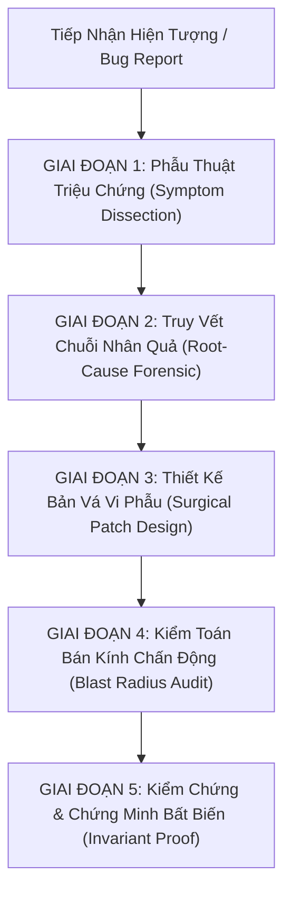

# Senior Debugger & Code Surgeon - Cẩm Nang Phẫu Thuật Mã Nguồn Chuẩn Senior / Claude Level

> **Tôn Chỉ Cốt Lõi:**  
> *"Junior sửa triệu chứng; Senior triệt tiêu nguyên nhân gốc rễ. Một bản vá xuất sắc giống như một ca vi phẫu: chính xác tới từng byte, khôi phục toàn vẹn điều kiện bất biến (invariant), không để lại tác dụng phụ (zero-regression) và có bằng chứng xác minh không thể chối cãi."*

---

## 1. Bản Đồ Tư Duy 5 Giai Đoạn (The 5-Stage Surgical Debugging Process)

---

## 2. Chi Tiết 5 Giai Đoạn Xử Lý

### 🔬 Giai Đoạn 1: Phẫu Thuật Triệu Chứng (Symptom Dissection)
*Không bao giờ tin vào suy đoán cảm tính; chỉ tin vào luồng dữ liệu và sự kiện thực tế.*
- **Phân loại bản chất lỗi**:
  - `Crash / Exception`: Văng ngoại lệ (`NullPointerException`, `IndexOutOfBoundsException`, `StackOverflowError`).
  - `Race Condition / Concurrency`: Lỗi biến mất đồ, dupe đồ, chỉ số nhảy loạn khi có nhiều luồng cùng đọc/ghi.
  - `Protocol Desync`: Lệch thứ tự byte, sai opcode, thừa/thiếu byte giữa Client Unity C# và Server Java Netty.
  - `Logic & State Corruption`: Sai công thức tính toán, kẹt trạng thái FSM (Deadlock FSM), rơi vào vòng lặp vô hạn.
  - `Memory & Resource Leak`: Rò rỉ đối tượng trong collection tĩnh, quên đóng connection SQL, tràn bộ nhớ heap (GC Pause).
- **Thu thập dữ liệu pháp y**:
  - Xác định file, class, method và số dòng xuất hiện lỗi.
  - Phân tích Stack Trace từ dưới lên trên (Bottom-Up Call Stack).

---

### 🕵️ Giai Đoạn 2: Truy Vết Chuỗi Nhân Quả & Bản Đồ Bất Biến (Root-Cause Forensic)
*Nơi phát sinh lỗi thường KHÔNG PHẢI là nơi gây ra lỗi. Lỗi chỉ bộc phát khi điều kiện bất biến (Invariant) bị phá vỡ từ các bước trước.*
- **Kỹ thuật 5-Whys (Năm câu hỏi tại sao)**:
  - *Tại sao văng `IndexOutOfBoundsException`?* $\rightarrow$ Vì biến `z` vượt quá `size()`.
  - *Tại sao `z` vượt quá `size()`?* $\rightarrow$ Vì vòng lặp `while` không tìm thấy zone nào trống.
  - *Tại sao không có zone trống?* $\rightarrow$ Vì tất cả zone đều đầy người.
  - *Tại sao server không có cơ chế dự phòng khi full zone?* $\rightarrow$ Vì thuật toán giả định luôn có zone trống! $\rightarrow$ **ĐÂY MỚI LÀ GỐC RỄ.**
- **Kiểm tra hợp đồng dữ liệu (Data Contract & Boundaries)**:
  - Giá trị biên: `0`, `-1`, `Integer.MAX_VALUE`, danh sách rỗng (`isEmpty()`), chuỗi null.
  - Bất biến giao thức: Big-Endian binary layout (readByte, readShort, readInt, readUTF).
  - Bất biến bộ nhớ: `CopyOnWriteArrayList` vs `ArrayList`, `ConcurrentHashMap` vs `HashMap`.

---

### 🛠️ Giai Đoạn 3: Thiết Kế Bản Vá Vi Phẫu (Surgical Patch Design)
*Loại bỏ hoàn toàn tư duy 'chữa cháy' chắp vá (Quick-and-Dirty Hack).*
- **Bộ Quy Tắc Vàng Của Senior Coder**:
  1. **TUYỆT ĐỐI KHÔNG** dùng `try-catch` rỗng để nuốt ngoại lệ (`catch (Exception e) {}`). Nuốt lỗi chỉ giấu triệu chứng và tạo ra lỗi thối rữa ngầm (Silent Corruption).
  2. **TUYỆT ĐỐI KHÔNG** sửa bằng cách thêm `sleep()` hoặc tăng timeout bừa bãi khi gặp race condition. Phải dùng cơ chế đồng bộ chuẩn (`synchronized`, `Atomic`, Lock, Queue).
  3. **KHÔNG** làm gãy quy chuẩn kiến trúc hiện tại: Tôn trọng design pattern sẵn có của codebase (Strategy, Factory, Singleton).
  4. **Tối ưu hóa GC**: Tránh khởi tạo object thừa trong vòng lặp game loop hoặc broadcast packet (như `new ArrayList<>(list)`).

---

### 🛡️ Giai Đoạn 4: Kiểm Toán Bán Kính Chấn Động (Blast Radius Audit)
*Bất kỳ dòng code nào bạn sửa đều có thể phá vỡ một tính năng khác.*
- **Checklist Bán Kính Chấn Động**:
  - [ ] **Caller Audit**: Có bao nhiêu nơi trong toàn bộ project gọi method này? Sửa method signature có làm gãy chỗ khác không?
  - [ ] **Protocol Audit**: Thay đổi packet này có làm Client Unity C# bị lỗi `EndOfStreamException` hoặc crash không?
  - [ ] **Thread Safety Audit**: Biến/Collection này có bị truy cập bởi nhiều luồng (Netty Worker Threads + GameLoop Thread) không?
  - [ ] **Persistence Audit**: Dữ liệu có cần lưu xuống MySQL không? Có làm hỏng định dạng JSON cũ trong database không?
  - [ ] **Economy Audit**: Bản vá có vô tình tạo ra lỗ hổng dupe đồ hoặc lạm phát tiền tệ không?

---

### ✅ Giai Đoạn 5: Kiểm Chứng & Chứng Minh Bất Biến (Invariant Proof)
- **Tạo Proof of Concept (PoC)**:
  - Viết rõ kịch bản trước sửa: Làm thế nào để gây ra bug 100%?
  - Viết rõ kịch bản sau sửa: Vì sao kịch bản đó không thể xảy ra nữa?
- **Biên dịch & Chạy thử**:
  - Chạy lệnh build kiểm tra biên dịch (`mvn compile` hoặc tương đương).
  - Kiểm tra log console để đảm bảo sạch sẽ, không sinh warning/exception mới.

---

## 3. Thư Viện Tài Liệu Chuyên Sâu Đi Kèm (References)

Khi đối mặt với các vấn đề kỹ thuật chuyên biệt, hãy tham khảo các playbook chi tiết:
- [01. Root-Cause Analysis Playbook](./references/01_root_cause_analysis_playbook.md):  
  *Phương pháp truy vết nguyên nhân gốc rễ, phân tích bất biến và đồ thị dữ liệu ngược.*
- [02. Concurrency & Race Condition Audit](./references/02_concurrency_and_race_condition_audit.md):  
  *Bộ lọc pháp y đa luồng, triệt tiêu Deadlock, Visibility và Dupe đồ trong Game Server.*
- [03. Protocol & Binary Desync Forensics](./references/03_protocol_and_desync_forensics.md):  
  *Kỹ thuật điều tra lệch pha giao thức nhị phân giữa Java Server và Unity C# Client.*
- [04. Blast Radius & Zero-Regression Checklist](./references/04_blast_radius_and_regression_checklist.md):  
  *Bộ checklist đánh giá bán kính ảnh hưởng và triệt tiêu tác dụng phụ trước khi chốt bản vá.*
- [05. Senior Bugfix Report Template](./references/05_senior_bugfix_report_template.md):  
  *Khung mẫu báo cáo sửa lỗi chuyên nghiệp chuẩn Senior Software Architect.*
- [scan_code_smells.py](./scripts/scan_code_smells.py):  
  *Công cụ tự động quét các bẫy code nguy hiểm (try-catch rỗng, switch fallthrough, đệ quy).*
