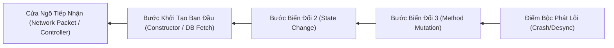

# Playbook Truy Vết Nguyên Nhân Gốc Rễ (Root-Cause Analysis)

## 1. Triết Lý Senior: "Triệu Chứng Không Phải Là Căn Bệnh"

Một lập trình viên sơ cấp (Junior) nhìn thấy:
`NullPointerException tại Zone.java:594` $\rightarrow$ Thêm `if (plInfo.location != null)` rồi đóng ticket.
Hậu quả: 1 tuần sau, quái không đánh được player, NPC không hiện, và xuất hiện người chơi ma tàng hình!

Một Senior Engineer / Claude nhìn thấy:
`NullPointerException tại Zone.java:594` $\rightarrow$ Tự hỏi:
1. *Tại sao `plInfo.location` lại null?* Vì nó là một đối tượng Player vừa khởi tạo chưa kịp gọi `initLocation()`? Hay một Boss vừa bị dispose nhưng chưa remove khỏi `humanoids`? Hay một luồng khác đã set `location = null`?
2. *Hợp đồng bất biến (Invariant):* Một thực thể sống trong Zone **BẮT BUỘC PHẢI CÓ TỌA ĐỘ**. Việc `location == null` chứng tỏ vòng đời (Lifecycle) của thực thể đã bị rách nát từ khâu nạp bản đồ hoặc khâu đăng nhập!
3. *Hành động:* Sửa tận gốc nơi vòng đời thực thể bị hở, đồng thời đặt rào chắn an toàn (Defensive Boundary) tại điểm phát tác.

---

## 2. Kỹ Thuật Đồ Thị Dữ Liệu Ngược (Reverse Data Flow Graph)

Khi một biến mang giá trị sai lệch (sai số, null, âm, tràn số), hãy dùng kỹ thuật 4 bước truy ngược:

### 4 Câu Hỏi Vàng Tại Mỗi Nút:
1. **Nút này có bị ghi đè bởi nhiều luồng (Concurrent Write) không?**
2. **Nút này có bị đột biến (Mutated) ngoài ý muốn thông qua Pass-by-reference không?**
3. **Nếu giá trị đầu vào là biên cực đoan (Boundary: `0`, `-1`, `null`, `Integer.MAX_VALUE`), nút này phản ứng ra sao?**
4. **Có giả định ngầm nào (Implicit Assumption) không được kiểm tra bằng code không?**

---

## 3. Ma Trận 6 Mẫu Lỗi Ngầm Điển Hình Trong Java Game Server

| Mẫu Lỗi (Bug Pattern) | Triệu Chứng Bề Nổi | Nguyên Nhân Gốc Rễ | Phương Pháp Xử Lý Chuẩn Senior |
|---|---|---|---|
| **Switch Fallthrough** | Dữ liệu trả về bị nối đuôi, desync packet, thừa item | Thiếu `break;` khiến luồng rơi sang case tiếp theo | Sử dụng switch expression dạng mũi tên `->` hoặc kiểm tra chặt chẽ `break;` sau mỗi case. |
| **Silent Catch** | Không có log lỗi, chức năng chết im lìm | Bọc `catch (Exception e) {}` không log hoặc chỉ printStackTrace | Bắt đúng exception cụ thể, ghi log có ngữ cảnh (`Logger.error("Ngữ cảnh...", e)`), trả về fallback an toàn. |
| **Infinite Recursion** | Server văng `StackOverflowError` | Hàm tự gọi lại chính nó hoặc 2 service gọi chéo vòng lặp (A gọi B, B gọi A) | Chuyển sang vòng lặp (Iteration) hoặc thêm điều kiện thoát cơ sở (Base Case) rõ ràng. |
| **Unbounded While Loop** | Treo CPU 100%, văng `IndexOutOfBoundsException` | Vòng lặp `while (condition) { index++; }` không có giới hạn `index < size` | Luôn sử dụng `for-each` hoặc thêm điều kiện bảo vệ `index < list.size()`. |
| **Leaked Heap Object** | Server chạy lâu bị giật lag, OOM heap dump | Lưu trữ Player / Session vào `static Map` hoặc List mà quên remove khi disconnect | Sử dụng WeakReference, hoặc dọn dẹp triệt để trong hàm `dispose()` / `disconnect()`. |
| **Integer Overflow** | Vàng/HP/Sức mạnh nhảy về số âm | Phép nhân hoặc cộng vượt quá `Integer.MAX_VALUE` ($2^{31}-1 \approx 2.14$ tỷ) | Đổi sang kiểu `long`, hoặc dùng `Math.min(limit, (long) a * b)`. |
