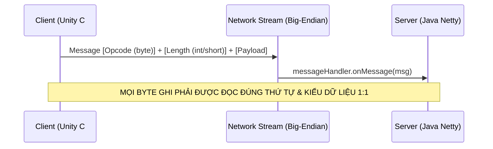

# Pháp Y Giao Thức Mạng & Triệt Tiêu Lệch Pha Nhị Phân (Protocol Desync Forensics)

## 1. Bản Chất Giao Thức Nhị Phân Giữa Java Server & Unity C# Client

Mọi giao tiếp giữa Server Java Netty và Client Unity C# đều sử dụng luồng nhị phân thuần túy theo thứ tự byte **Big-Endian** (Network Byte Order).



---

## 2. Bảng Đối Chiếu Kiểu Dữ Liệu 1:1 (Type Alignment Contract)

| Kiểu Java (Server) | Phương thức Ghi / Đọc | Số Byte | Kiểu C# (Client) | Phương thức Đọc C# |
|---|---|:---:|---|---|
| `byte` / `boolean` | `writeByte(b)` / `writeBoolean(bool)` | 1 | `sbyte` / `byte` / `bool` | `dis.readByte()` / `dis.readBoolean()` |
| `short` | `writeShort(s)` | 2 | `short` / `Int16` | `dis.readShort()` |
| `int` | `writeInt(i)` | 4 | `int` / `Int32` | `dis.readInt()` |
| `long` | `writeLong(l)` | 8 | `long` / `Int64` | `dis.readLong()` |
| `String` | `writeUTF(str)` | 2 + N | `string` | `dis.readUTF()` (2 byte length + N bytes) |

---

## 3. 3 Hội Chứng Lệch Pha Giao Thức Thảm Họa (Catastrophic Desync Syndromes)

### Hội Chứng 1: Nuốt Thiếu Byte (Buffer Underflow / Desync Cascade)
- **Cơ chế**: Server gửi 5 trường dữ liệu (`byte`, `short`, `int`, `UTF`, `byte`), nhưng Client chỉ đọc 4 trường (`byte`, `short`, `int`, `UTF`) rồi kết thúc hàm xử lý message.
- **Hậu quả dây chuyền**:
  1. 1 byte thừa còn sót lại trong TCP stream buffer của Client.
  2. Khi gói tin tiếp theo bay đến, Client lấy byte thừa đó làm **OPCODE** của gói tin mới!
  3. Client văng lỗi `"Unknown Opcode"`, ném `EndOfStreamException` hoặc disconnect toàn bộ kết nối.

### Hội Chứng 2: Switch Fallthrough Ghi Nối Tiếp (Packet Payload Overwrite)
- **Cơ chế**: Trong switch-case xử lý loại gói tin, thiếu lệnh `break;`.
- **Hậu quả**: Server ghi xong Payload của Case A, rơi xuống ghi tiếp Payload của Case B vào cùng 1 packet `Message`. Client chỉ mong đợi đọc format Case A, khi đọc sang phần thừa của Case B sẽ gây crash UI hoặc văng ngoại lệ parse.

### Hội Chứng 3: String UTF Null hoặc Quá Dài
- **Cơ chế**: `msg.writer().writeUTF(null)`. Trong Java, thư viện nhị phân có thể ném `NullPointerException` ngay tại luồng gửi hoặc ghi chuỗi rỗng không chuẩn.
- **Quy tắc bất biến**: Luôn bọc chuỗi an toàn:
  ```java
  msg.writer().writeUTF(text != null ? text : "");
  ```

---

## 4. Checklist Pháp Y Giao Thức (Protocol Forensic Checklist)

Trước khi commit bất kỳ chỉnh sửa nào liên quan đến `Message`:
- [ ] **Mở song song 2 file**: `Service.java` (Server gửi) và file xử lý packet tương ứng trên Client (`Service.cs` hoặc `Controller.cs`).
- [ ] **Đếm từng dòng byte**:
  - Dòng 1: Ghi byte $\rightarrow$ Đọc byte.
  - Dòng 2: Ghi short $\rightarrow$ Đọc short.
  - Dòng 3: Ghi UTF $\rightarrow$ Đọc UTF.
- [ ] **Kiểm tra độ dài mảng**: Nếu ghi danh sách `List.size()`, kiểm tra kiểu dữ liệu của biến đếm kích thước: dùng `writeByte` (nếu $\le 127$) hay `writeShort` (nếu $> 127$). Client đọc đúng byte hay short?
- [ ] **Dọn dẹp buffer**: Luôn có khối `finally { msg.cleanup(); }` để giải phóng Netty ByteBuf, chống tràn bộ nhớ Direct Buffer (Off-Heap Leak).
