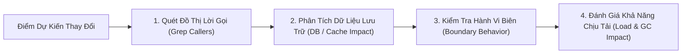

# Kiểm Toán Bán Kính Chấn Động & Phòng Chống Hồi Quy (Blast Radius & Zero-Regression)

## 1. Khái Niệm "Bán Kính Chấn Động" (Blast Radius)

Trong hệ thống phần mềm phức tạp như Game Server:
> **"Không có thay đổi nào là độc lập tuyệt đối."**

Một thay đổi tưởng chừng nhỏ nhặt tại `Zone.java` hoặc `ChangeMapService.java` có thể kích hoạt sóng chấn động lan tới:
- Hệ thống Nhiệm Vụ (Task Tracking): Quái đếm sai, không nhận diện được map.
- Hệ thống Boss AI: Boss không tìm thấy Zone để respawn hoặc tấn công mục tiêu ma.
- Hệ thống Bang Hội / Phó Bản: Mất dữ liệu tiến độ phó bản khi chuyển map.
- Hệ thống Giao Dịch & Kinh Tế: Mất đồ rơi hoặc dupe vật phẩm.

---

## 2. Quy Trình 4 Bước Đánh Giá Bán Kính Chấn Động

### Bước 1: Quét Đồ Thị Lời Gọi (Grep Callers)
- Dùng công cụ `grep_search` quét toàn bộ dự án để tìm **TẤT CẢ** các nơi gọi hàm/phương thức đó.
- Ví dụ: Trước khi sửa `MapService.getZone(int mapId)`, phải kiểm tra có bao nhiêu nơi trong code đang phụ thuộc vào hành vi trả về của hàm này:
  - `ChangeMapService`
  - `TrainingService`
  - `BossManager`
  - `SuperDivineWaterService`
- **Quy tắc:** Đảm bảo giá trị trả về mới (Return Value) hoặc ngoại lệ mới không làm gãy bất kỳ caller nào trong danh sách.

### Bước 2: Phân Tích Dữ Liệu Lưu Trữ (Database & Cache Impact)
- Dữ liệu bị thay đổi có được serialize thành JSON lưu vào database (bảng `player`, `clan`, `account`) không?
- Nếu có: Tài khoản cũ với dữ liệu JSON được lưu từ bản build trước có đọc được bình thường không? Có bị `JsonSyntaxException` hoặc `NullPointerException` khi parse các field cũ không?

### Bước 3: Kiểm Tra Hành Vi Biên (Boundary Behavior)
- Khi `Player == null` (vừa ngắt kết nối).
- Khi `Zone == null` hoặc `Map == null` (map không tồn tại).
- Khi `List.isEmpty()` (danh sách rỗng).
- Khi số lượng người chơi đạt cực đại (`Zone.isFull()`).

### Bước 4: Đánh Giá Khả Năng Chịu Tải (Load & GC Impact)
- Code mới có nằm trong GameLoop tick (chạy mỗi 100ms) không?
- Code mới có cấp phát mảng, collection hoặc string concatenation (`+`) liên tục trong vòng lặp không?
- Có làm tăng thời gian giữ Monitor lock (`synchronized`) gây tắc nghẽn các thread khác không?

---

## 3. Bảng Kiểm Soát Zero-Regression (Zero-Regression Checklist)

Mọi kỹ sư / Agent trước khi hoàn tất bản vá phải tự tích kiểm đủ 7 tiêu chí:
- [ ] **[ ] Compile Pass**: Mã nguồn biên dịch thành công 100% không phát sinh lỗi hoặc warning mới.
- [ ] **[ ] No New NullPointer**: Toàn bộ chuỗi truy cập thuộc tính sâu (`a.b.c.d`) đều được kiểm tra null hoặc đảm bảo đã khởi tạo.
- [ ] **[ ] Clean Resource Release**: Mọi `Message`, `ResultSet`, `Connection`, `InputStream` đều được bọc trong `try-with-resources` hoặc có `finally` dọn dẹp.
- [ ] **[ ] Thread-Safe Concurrency**: Không có truy cập ghi đồng thời vào collection không đồng bộ.
- [ ] **[ ] Protocol Alignment**: Giữ nguyên độ dài và định dạng byte stream truyền về Client.
- [ ] **[ ] Backward Compatibility**: Tương thích ngược với các tài khoản tạo từ phiên bản cũ.
- [ ] **[ ] PoC Verified**: Đã kiểm tra thực tế bằng kịch bản tái hiện lỗi và chứng minh lỗi đã biến mất.
